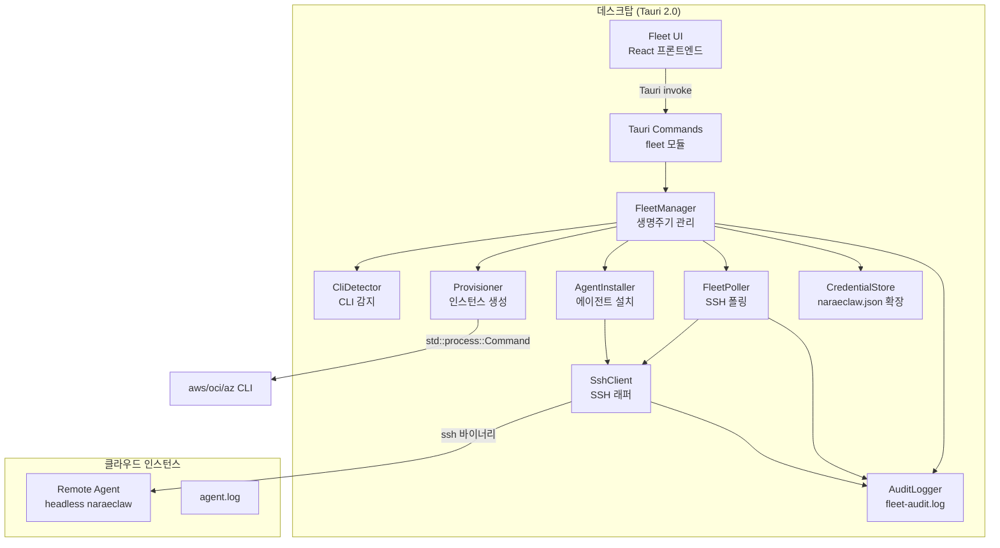
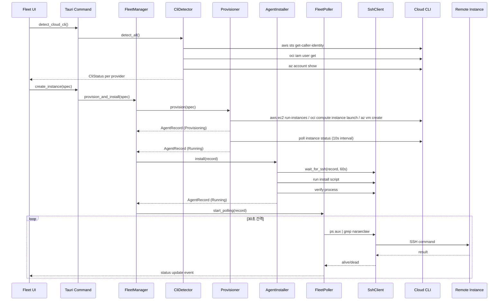

# 설계 문서: Cloud Agent Fleet

## 개요

Cloud Agent Fleet는 NaraeClaw 데스크탑(Tauri 2.0)에서 AWS, OCI, Azure 클라우드에 경량 naraeclaw 에이전트를 배포하고 원격 제어하는 기능이다. 로컬 클라우드 CLI의 인증 컨텍스트를 재사용하여 인스턴스를 프로비저닝하고, SSH를 통해 에이전트를 설치·모니터링·제어한다.

핵심 설계 원칙:
- **CLI 재사용**: 별도 SDK 의존 없이 로컬 `aws`/`oci`/`az` CLI 바이너리를 `std::process::Command`로 호출
- **SSH 폴링**: 릴레이 인프라 없이 SSH를 통한 단방향 폴링으로 원격 에이전트 제어
- **기존 패턴 준수**: Tauri `SharedState`, `GatewayClient`, `health::spawn_health_poller` 등 기존 아키텍처 패턴을 따름
- **보안 우선**: SSH 키 내용 미복사, 자격증명 로그 미기록, 감사 로그 기록

## 아키텍처

### 전체 구조



### 계층 구조

```
apps/tauri/src/
├── commands/
│   └── fleet.rs              # Tauri IPC 커맨드 (Fleet UI ↔ Rust)
├── fleet/
│   ├── mod.rs                # Fleet 모듈 루트
│   ├── manager.rs            # FleetManager — 생명주기 오케스트레이션
│   ├── cli_detector.rs       # CliDetector — CLI 바이너리 감지 및 인증 확인
│   ├── provisioner.rs        # Provisioner — 클라우드 인스턴스 생성/삭제
│   ├── installer.rs          # AgentInstaller — SSH를 통한 에이전트 설치
│   ├── poller.rs             # FleetPoller — 주기적 SSH 상태 폴링
│   ├── ssh_client.rs         # SshClient — ssh 바이너리 래퍼
│   ├── credential_store.rs   # CredentialStore — naraeclaw.json 확장
│   ├── audit.rs              # AuditLogger — fleet-audit.log 기록
│   └── types.rs              # 공유 타입 (CloudProvider, AgentRecord 등)
```

### 데이터 흐름



## 컴포넌트 및 인터페이스

### 1. FleetManager

Fleet 전체 생명주기를 오케스트레이션하는 중앙 컴포넌트. `Arc<RwLock<FleetState>>`로 상태를 관리하며, Tauri `AppHandle`을 통해 프론트엔드에 이벤트를 발행한다.

```rust
pub struct FleetManager {
    state: Arc<RwLock<FleetState>>,
    credential_store: CredentialStore,
    audit_logger: AuditLogger,
    poller_handles: Arc<Mutex<HashMap<String, tokio::task::JoinHandle<()>>>>,
}

pub struct FleetState {
    pub agents: Vec<AgentRecord>,
}

impl FleetManager {
    pub async fn provision_and_install(&self, spec: InstanceSpec) -> Result<AgentRecord>;
    pub async fn stop_agent(&self, agent_id: &str) -> Result<()>;
    pub async fn restart_agent(&self, agent_id: &str) -> Result<()>;
    pub async fn delete_agent(&self, agent_id: &str) -> Result<()>;
    pub async fn list_agents(&self) -> Vec<AgentRecord>;
    pub async fn get_agent(&self, agent_id: &str) -> Option<AgentRecord>;
    pub async fn shutdown(&self);  // 앱 종료 시 폴링 태스크 정리
}
```

### 2. CliDetector

로컬 `PATH`에서 클라우드 CLI 바이너리를 탐색하고 인증 상태를 확인한다.

```rust
pub struct CliDetector;

#[derive(Debug, Clone, Serialize)]
pub struct CliStatus {
    pub provider: CloudProvider,
    pub installed: bool,
    pub authenticated: bool,
    pub error_message: Option<String>,
    pub install_url: Option<String>,
}

impl CliDetector {
    pub async fn detect_all() -> Vec<CliStatus>;
    pub async fn detect(provider: CloudProvider) -> CliStatus;
    async fn check_binary(binary_name: &str) -> bool;
    async fn check_auth(provider: CloudProvider) -> Result<()>;
}
```

### 3. Provisioner

클라우드 CLI를 호출하여 인스턴스를 생성·삭제한다.

```rust
pub struct Provisioner {
    audit_logger: AuditLogger,
}

impl Provisioner {
    pub async fn provision(&self, spec: &InstanceSpec) -> Result<AgentRecord>;
    pub async fn terminate(&self, record: &AgentRecord) -> Result<()>;
    async fn wait_for_running(&self, record: &mut AgentRecord, timeout: Duration) -> Result<()>;
    fn build_create_command(spec: &InstanceSpec) -> Command;
    fn parse_instance_output(provider: CloudProvider, output: &str) -> Result<(String, String)>;
}
```

### 4. AgentInstaller

SSH를 통해 원격 인스턴스에 naraeclaw 에이전트를 설치하고 시작한다.

```rust
pub struct AgentInstaller {
    ssh_client: SshClient,
    audit_logger: AuditLogger,
}

impl AgentInstaller {
    pub async fn install(&self, record: &mut AgentRecord) -> Result<()>;
    async fn wait_for_ssh(&self, record: &AgentRecord, timeout: Duration) -> Result<()>;
    async fn upload_and_start(&self, record: &AgentRecord) -> Result<()>;
    async fn verify_process(&self, record: &AgentRecord) -> Result<bool>;
}
```

### 5. FleetPoller

각 에이전트에 대해 독립적인 폴링 태스크를 관리한다. 기존 `health::spawn_health_poller` 패턴을 따른다.

```rust
pub struct FleetPoller {
    ssh_client: SshClient,
    audit_logger: AuditLogger,
}

impl FleetPoller {
    pub fn spawn_agent_poller(
        &self,
        app: AppHandle,
        state: Arc<RwLock<FleetState>>,
        agent_id: String,
    ) -> JoinHandle<()>;

    pub async fn fetch_logs(
        &self,
        record: &AgentRecord,
        lines: usize,
    ) -> Result<String>;

    pub async fn tail_logs(
        &self,
        record: &AgentRecord,
    ) -> Result<String>;
}
```

### 6. SshClient

로컬 `ssh` 바이너리를 `std::process::Command`로 호출하는 래퍼. 타임아웃, 호스트 키 검증, 명령 필터링을 담당한다.

```rust
pub struct SshClient {
    audit_logger: AuditLogger,
}

pub struct SshConnectionInfo {
    pub host: String,
    pub port: u16,
    pub user: String,
    pub key_path: PathBuf,
    pub strict_host_key_checking: bool,
}

pub struct SshResult {
    pub stdout: String,
    pub stderr: String,
    pub exit_code: i32,
}

impl SshClient {
    pub async fn execute(
        &self,
        conn: &SshConnectionInfo,
        command: &str,
        timeout: Duration,
    ) -> Result<SshResult>;

    pub async fn check_connectivity(
        &self,
        conn: &SshConnectionInfo,
        timeout: Duration,
    ) -> Result<bool>;

    pub fn validate_command(command: &str) -> Result<()>;
}
```

### 7. CredentialStore

기존 Tauri `naraeclaw.json` store를 확장하여 AgentRecord를 저장한다.

```rust
pub struct CredentialStore {
    store_path: PathBuf,
}

impl CredentialStore {
    pub fn load_agents(&self) -> Result<Vec<AgentRecord>>;
    pub fn save_agents(&self, agents: &[AgentRecord]) -> Result<()>;
    pub fn ensure_permissions(&self) -> Result<()>;  // 0600 권한 확인
}
```

### 8. AuditLogger

Fleet 관련 모든 작업을 `~/.naraeclaw/fleet-audit.log`에 기록한다.

```rust
pub struct AuditLogger {
    log_path: PathBuf,
}

#[derive(Serialize)]
pub struct AuditEntry {
    pub timestamp: chrono::DateTime<chrono::Utc>,
    pub action: AuditAction,
    pub agent_id: Option<String>,
    pub details: String,
    pub success: bool,
}

#[derive(Serialize)]
pub enum AuditAction {
    SshConnect,
    SshCommand,
    Provision,
    Install,
    Stop,
    Restart,
    Delete,
    CliDetect,
    HostKeyOverride,
}

impl AuditLogger {
    pub fn log(&self, entry: AuditEntry) -> Result<()>;
}
```

### 9. Tauri Commands (Fleet IPC)

기존 `commands/` 패턴을 따라 Fleet UI와 Rust 백엔드를 연결한다.

```rust
// apps/tauri/src/commands/fleet.rs

#[tauri::command]
pub async fn detect_cloud_cli() -> Result<Vec<CliStatus>, String>;

#[tauri::command]
pub async fn create_instance(
    state: State<'_, FleetManagerState>,
    spec: InstanceSpec,
) -> Result<AgentRecord, String>;

#[tauri::command]
pub async fn list_fleet_agents(
    state: State<'_, FleetManagerState>,
) -> Result<Vec<AgentRecord>, String>;

#[tauri::command]
pub async fn get_agent_detail(
    state: State<'_, FleetManagerState>,
    agent_id: String,
) -> Result<AgentRecord, String>;

#[tauri::command]
pub async fn stop_agent(
    state: State<'_, FleetManagerState>,
    agent_id: String,
) -> Result<(), String>;

#[tauri::command]
pub async fn restart_agent(
    state: State<'_, FleetManagerState>,
    agent_id: String,
) -> Result<(), String>;

#[tauri::command]
pub async fn delete_agent(
    state: State<'_, FleetManagerState>,
    agent_id: String,
) -> Result<(), String>;

#[tauri::command]
pub async fn send_remote_command(
    state: State<'_, FleetManagerState>,
    agent_id: String,
    command: String,
) -> Result<SshResult, String>;

#[tauri::command]
pub async fn fetch_agent_logs(
    state: State<'_, FleetManagerState>,
    agent_id: String,
    lines: Option<usize>,
) -> Result<String, String>;
```

## 데이터 모델

### CloudProvider

```rust
#[derive(Debug, Clone, Copy, PartialEq, Eq, Serialize, Deserialize)]
#[serde(rename_all = "lowercase")]
pub enum CloudProvider {
    Aws,
    Oci,
    Azure,
}

impl CloudProvider {
    pub fn cli_binary(&self) -> &'static str {
        match self {
            Self::Aws => "aws",
            Self::Oci => "oci",
            Self::Azure => "az",
        }
    }

    pub fn display_name(&self) -> &'static str {
        match self {
            Self::Aws => "AWS",
            Self::Oci => "OCI",
            Self::Azure => "Azure",
        }
    }

    pub fn install_url(&self) -> &'static str {
        match self {
            Self::Aws => "https://docs.aws.amazon.com/cli/latest/userguide/getting-started-install.html",
            Self::Oci => "https://docs.oracle.com/en-us/iaas/Content/API/SDKDocs/cliinstall.htm",
            Self::Azure => "https://learn.microsoft.com/en-us/cli/azure/install-azure-cli",
        }
    }
}
```

### AgentStatus

```rust
#[derive(Debug, Clone, Copy, PartialEq, Eq, Serialize, Deserialize)]
#[serde(rename_all = "snake_case")]
pub enum AgentStatus {
    Provisioning,
    Installing,
    Running,
    Stopped,
    Error,
    Terminated,
}
```

### InstanceSpec

```rust
#[derive(Debug, Clone, Serialize, Deserialize)]
pub struct InstanceSpec {
    pub provider: CloudProvider,
    pub region: String,
    pub instance_type: String,
    pub ssh_key_path: PathBuf,
    pub ssh_user: String,
    pub security_group_id: Option<String>,
    pub image_id: Option<String>,
    pub tags: HashMap<String, String>,
}
```

### AgentRecord

```rust
#[derive(Debug, Clone, Serialize, Deserialize)]
pub struct AgentRecord {
    pub id: String,                          // UUID v4
    pub provider: CloudProvider,
    pub region: String,
    pub instance_id: String,                 // 클라우드 인스턴스 ID
    pub public_ip: String,                   // 공인 IP 또는 DNS
    pub ssh_key_path: PathBuf,
    pub ssh_user: String,
    pub ssh_port: u16,                       // 기본 22
    pub status: AgentStatus,
    pub error_message: Option<String>,
    pub created_at: chrono::DateTime<chrono::Utc>,
    pub last_checked_at: Option<chrono::DateTime<chrono::Utc>>,
    pub consecutive_failures: u32,           // 연속 폴링 실패 횟수
    pub strict_host_key_checking: bool,      // 기본 true
    pub tags: HashMap<String, String>,
}
```

### InstanceSpec 유효성 검증

```rust
impl InstanceSpec {
    pub fn validate(&self) -> Result<(), Vec<String>> {
        let mut errors = Vec::new();
        if self.region.trim().is_empty() {
            errors.push("리전이 비어 있습니다".into());
        }
        if self.instance_type.trim().is_empty() {
            errors.push("인스턴스 타입이 비어 있습니다".into());
        }
        if !self.ssh_key_path.exists() {
            errors.push(format!("SSH 키 파일이 존재하지 않습니다: {}", self.ssh_key_path.display()));
        }
        if errors.is_empty() { Ok(()) } else { Err(errors) }
    }
}
```


## 정확성 속성 (Correctness Properties)

*속성(property)은 시스템의 모든 유효한 실행에서 참이어야 하는 특성 또는 동작이다. 속성은 사람이 읽을 수 있는 명세와 기계가 검증할 수 있는 정확성 보장 사이의 다리 역할을 한다.*

### Property 1: CLI 명령 생성 정확성

*임의의* CloudProvider와 유효한 InstanceSpec에 대해, `build_create_command`가 생성한 Command는 해당 프로바이더의 CLI 바이너리(`aws`/`oci`/`az`)를 사용하고, InstanceSpec의 region, instance_type, ssh_key_path를 명령 인수에 포함해야 한다.

**Validates: Requirements 2.1, 2.2**

### Property 2: 인스턴스 출력 파싱 라운드트립

*임의의* 유효한 인스턴스 ID와 IP 주소 쌍에 대해, 해당 값을 포함하는 프로바이더별 JSON 출력을 생성한 후 `parse_instance_output`으로 파싱하면 원래의 인스턴스 ID와 IP 주소가 복원되어야 한다.

**Validates: Requirements 2.3**

### Property 3: InstanceSpec 유효성 검증

*임의의* InstanceSpec에 대해, 필수 필드(region, instance_type, ssh_key_path)가 하나라도 비어있거나 존재하지 않으면 `validate()`는 Err를 반환하고, 모든 필수 필드가 유효하면 Ok를 반환해야 한다.

**Validates: Requirements 2.7**

### Property 4: CLI 실패 시 Error 상태 전이

*임의의* 0이 아닌 종료 코드와 stderr 내용에 대해, 프로비저닝 또는 설치 과정에서 CLI/SSH 명령이 실패하면 AgentRecord의 status는 `Error`로 설정되고 error_message는 stderr 내용을 포함해야 한다.

**Validates: Requirements 2.5, 3.6**

### Property 5: 프로세스 확인 결과에 따른 상태 전이

*임의의* AgentRecord에 대해, 프로세스 확인(verify_process)이 성공하면 status는 `Running`으로, 실패하면 status는 `Error`로 설정되어야 한다.

**Validates: Requirements 3.6, 3.7**

### Property 6: SSH 명령 생성 정확성

*임의의* SshConnectionInfo에 대해, 생성된 ssh 명령은 `-i {key_path}`, `{user}@{host}`, `-p {port}`를 포함하고, `strict_host_key_checking`이 true이면 `StrictHostKeyChecking=yes`를, false이면 `StrictHostKeyChecking=no`를 포함해야 한다.

**Validates: Requirements 3.2, 8.3**

### Property 7: 연속 폴링 실패 시 Stopped 상태 전이

*임의의* 폴링 결과 시퀀스에 대해, 연속 3회 실패(타임아웃, 거부, 프로세스 미감지 포함) 시 AgentRecord의 status는 `Stopped`로 변경되어야 하며, 중간에 성공이 있으면 consecutive_failures 카운터가 0으로 리셋되어야 한다.

**Validates: Requirements 5.3, 5.7**

### Property 8: AgentRecord 필터링 정확성

*임의의* AgentRecord 목록과 CloudProvider 또는 AgentStatus 필터에 대해, 필터링 결과는 필터 조건을 만족하는 레코드만 포함하고, 원본 목록에서 조건을 만족하는 모든 레코드를 포함해야 한다.

**Validates: Requirements 4.8**

### Property 9: 저장 데이터 민감 정보 미포함

*임의의* AgentRecord에 대해, `CredentialStore`를 통해 직렬화된 데이터에는 SSH 개인 키 내용, 클라우드 API 토큰, 비밀번호가 포함되지 않아야 한다. SSH 키 파일 경로만 저장되어야 한다.

**Validates: Requirements 8.1, 8.2**

### Property 10: 로그 출력 민감 정보 필터링

*임의의* 자격증명 문자열(AWS_ACCESS_KEY_ID 값, OCI_CLI_KEY_FILE 내용 등)이 포함된 CLI 출력에 대해, 로그 필터링 후 해당 자격증명 값이 로그에 기록되지 않아야 한다. 감사 로그에도 SSH 키 내용이나 자격증명 필드가 포함되지 않아야 한다.

**Validates: Requirements 1.6, 8.6, 8.7**

### Property 11: 명령 전송 상태 게이트

*임의의* AgentStatus에 대해, `Running` 상태일 때만 원격 명령 전송이 허용되고, 그 외 상태(`Provisioning`, `Installing`, `Stopped`, `Error`, `Terminated`)에서는 명령 전송이 거부되어야 한다.

**Validates: Requirements 6.5**

### Property 12: 명령 입력 검증

*임의의* 문자열에 대해, `validate_command`는 제어 문자(ASCII 0x00-0x1F 중 탭·개행 제외)를 거부하고, 4096바이트를 초과하는 입력을 거부해야 한다. 유효한 입력은 통과시켜야 한다.

**Validates: Requirements 6.7**

### Property 13: 중지 후 AgentRecord 보존

*임의의* AgentRecord에 대해, `stop_agent` 호출 후 해당 AgentRecord는 Fleet 목록에 여전히 존재하고, status만 `Stopped`로 변경되며, 나머지 메타데이터(id, provider, region, instance_id 등)는 변경되지 않아야 한다.

**Validates: Requirements 7.6**

### Property 14: CLI 미설치 시 비활성 상태 및 설치 안내

*임의의* CloudProvider에 대해, CLI 바이너리가 PATH에 존재하지 않으면 CliStatus의 installed는 false이고 install_url은 해당 프로바이더의 공식 설치 페이지 URL을 포함해야 한다.

**Validates: Requirements 1.3**

### Property 15: SSH 키 파일 미존재 시 연결 거부

*임의의* 존재하지 않는 파일 경로에 대해, SshClient는 SSH 연결을 시도하지 않고 명확한 오류 메시지를 반환해야 한다.

**Validates: Requirements 8.8**

## 오류 처리

### CLI 관련 오류

| 오류 상황 | 처리 방식 |
|-----------|-----------|
| CLI 바이너리 미설치 | `CliStatus.installed = false`, 설치 안내 URL 제공 |
| CLI 인증 만료 | `CliStatus.authenticated = false`, 재인증 방법 안내 |
| 인스턴스 생성 CLI 실패 | `AgentRecord.status = Error`, stderr를 error_message에 저장 |
| 인스턴스 120초 타임아웃 | `AgentRecord.status = Error`, 타임아웃 오류 기록 |
| 인스턴스 종료 CLI 실패 | 오류 기록, AgentRecord 유지, 수동 삭제 방법 안내 |

### SSH 관련 오류

| 오류 상황 | 처리 방식 |
|-----------|-----------|
| SSH 키 파일 미존재/권한 없음 | 연결 시도 안 함, 명확한 오류 메시지 반환 |
| SSH 포트 60초 미응답 | 설치 중단, `AgentRecord.status = Error` |
| SSH 폴링 10초 타임아웃 | 해당 폴링 실패 기록, 즉시 상태 변경 안 함 |
| SSH 연속 3회 실패 | `AgentRecord.status = Stopped`, Fleet_UI 알림 |
| 명령 실행 60초 타임아웃 | 오류 메시지 반환 |
| 명령 실행 중 연결 끊김 | 오류 메시지 + 부분 출력 반환 |

### 입력 검증 오류

| 오류 상황 | 처리 방식 |
|-----------|-----------|
| InstanceSpec 필수 필드 누락 | 생성 전 검증 실패, 구체적 오류 목록 반환 |
| 명령에 제어 문자 포함 | 명령 전송 거부, 오류 메시지 반환 |
| 명령 길이 4096바이트 초과 | 명령 전송 거부, 오류 메시지 반환 |
| Running 아닌 상태에서 명령 전송 | 명령 거부, 현재 상태 안내 |

### 보안 오류

| 오류 상황 | 처리 방식 |
|-----------|-----------|
| 호스트 키 검증 비활성화 | 감사 로그 기록, Fleet_UI 경고 배지 표시 |
| store 파일 권한 부적절 | `ensure_permissions()`로 0600 설정 시도 |

## 테스트 전략

### 이중 테스트 접근법

이 기능은 순수 로직(명령 생성, 파싱, 상태 전이, 검증)과 외부 의존(CLI 프로세스, SSH, 파일시스템)이 혼합되어 있으므로, 속성 기반 테스트와 단위/통합 테스트를 병행한다.

### 속성 기반 테스트 (Property-Based Testing)

라이브러리: `proptest` (Rust 생태계 표준 PBT 라이브러리)

각 속성 테스트는 최소 100회 반복 실행하며, 설계 문서의 속성 번호를 태그로 참조한다.

태그 형식: `// Feature: cloud-agent-fleet, Property {number}: {title}`

테스트 대상 순수 로직:
- `build_create_command` — CLI 명령 생성 (Property 1)
- `parse_instance_output` — 인스턴스 출력 파싱 (Property 2)
- `InstanceSpec::validate` — 입력 검증 (Property 3)
- 상태 전이 로직 — Error/Running/Stopped 전이 (Property 4, 5, 7, 13)
- SSH 명령 생성 — SshConnectionInfo → ssh 인수 (Property 6)
- AgentRecord 필터링 — 목록 필터 (Property 8)
- 직렬화 민감 정보 검증 — CredentialStore (Property 9)
- 로그 필터링 — 자격증명 필터 (Property 10)
- 명령 전송 게이트 — AgentStatus 확인 (Property 11)
- `validate_command` — 명령 입력 검증 (Property 12)
- CliStatus 생성 — CLI 미설치 시 (Property 14)
- SSH 키 파일 검증 — 파일 존재 확인 (Property 15)

### 단위 테스트 (Example-Based)

- 각 CloudProvider별 인증 확인 명령 생성 확인
- security_group_id Some/None에 따른 Command 인수 차이
- 각 AgentStatus별 상태 배지 색상 매핑
- 감사 로그 항목 직렬화 형식 확인
- 앱 종료 시 shutdown() 동작 확인

### 통합 테스트

mock CLI/SSH 바이너리를 사용하여:
- 전체 프로비저닝 → 설치 → 폴링 흐름
- CLI 인증 성공/실패 시나리오
- SSH 연결 타임아웃/거부 시나리오
- 독립적 폴링 태스크 격리 확인
- 인스턴스 종료 성공/실패 시나리오

### 프론트엔드 테스트

React 컴포넌트 테스트:
- Fleet 목록 렌더링 (빈 상태, 다수 에이전트)
- 상태 배지 색상
- 인스턴스 생성 폼 유효성 검증
- 삭제 확인 다이얼로그
- 진행 중 스피너 및 버튼 비활성화
- 필터링 UI 동작
