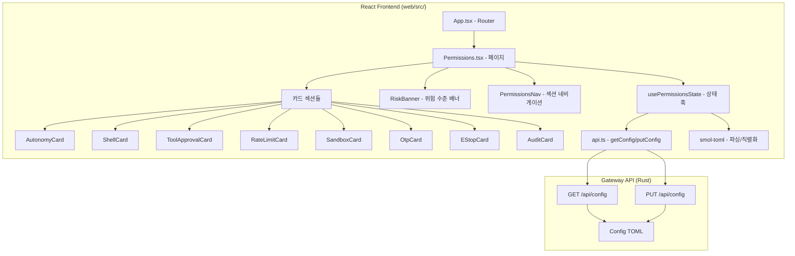
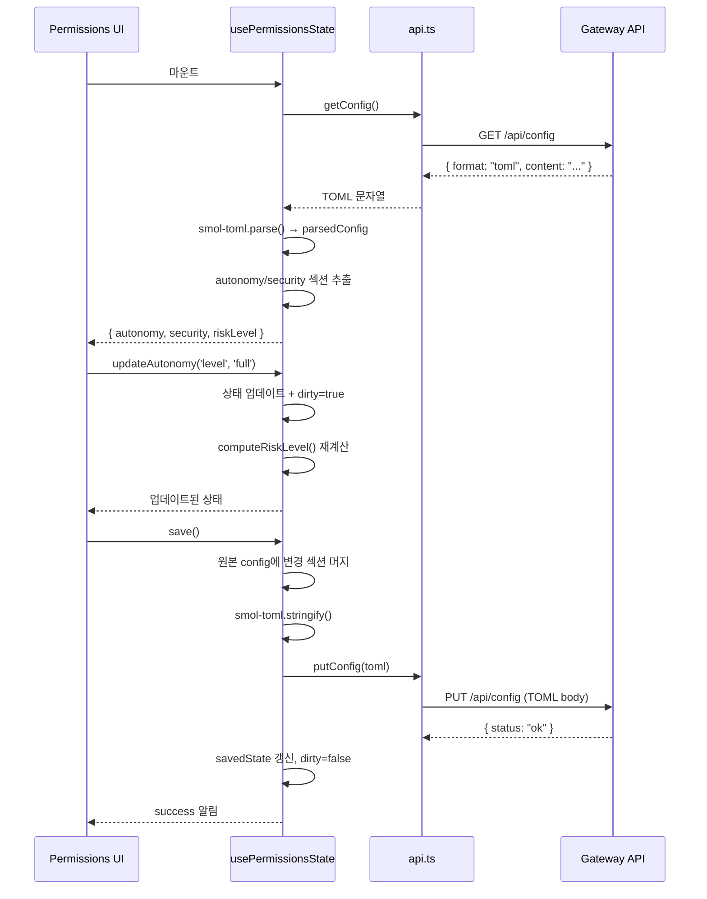

# 설계 문서: 데스크탑 권한 관리 화면

## 개요

NaraeClaw 데스크탑 앱의 에이전트 자율성·보안·감사 설정을 시각적으로 제어하는 전용 권한 관리 페이지(`/permissions`)를 구현한다. 기존 `Config` 페이지의 TOML 편집 방식과 달리, 카드 기반 레이아웃과 인터랙티브 컨트롤(세그먼트 슬라이더, 토글, 칩 목록, 범위 슬라이더)을 사용하여 모던 대시보드 UX를 제공한다.

기존 코드베이스 조사 결과:
- **Gateway API**: `GET /api/config`는 TOML 문자열을 반환하고, `PUT /api/config`는 TOML 문자열을 받아 저장한다. 프론트엔드에서 `smol-toml` 라이브러리로 파싱/직렬화한다.
- **Config 페이지 패턴**: `useConfigState` 훅이 `parsedConfig` (JS 객체)와 `rawToml` (문자열)을 동기화하며, `updateField(path, value)` 패턴으로 dot-path 기반 필드 업데이트를 수행한다.
- **UI 컨트롤**: `web/src/pages/config/controls/`에 `Toggle`, `Slider`, `NumberInput`, `Select`, `TextInput`, `SectionCard`, `FieldRow` 컴포넌트가 이미 존재한다.
- **백엔드 스키마**: `AutonomyConfig`와 `SecurityConfig`(sandbox, resources, audit, otp, estop 중첩)가 `crates/naraeclaw-config/src/schema/security.rs`에 정의되어 있다.

## 아키텍처



### 설계 결정

1. **기존 `useConfigState` 재사용 vs 전용 훅**: 전용 `usePermissionsState` 훅을 생성한다. `useConfigState`의 `parsedConfig` + `updateField` 패턴을 그대로 따르되, 권한 관련 필드(`autonomy.*`, `security.*`)만 추출하여 타입 안전한 인터페이스를 제공한다. 저장 시에는 전체 config TOML을 읽어와서 권한 섹션만 머지한 후 `PUT /api/config`로 전송한다.

2. **기존 컨트롤 컴포넌트 재사용**: `Toggle`, `Slider`, `NumberInput`, `Select`, `SectionCard`, `FieldRow`를 그대로 재사용한다. 새로 필요한 컨트롤은 `ChipList`(칩 목록 편집)와 `SegmentSlider`(3단계 세그먼트 선택기)뿐이다.

3. **위험 수준 계산**: 순수 함수 `computeRiskLevel(config)`로 분리하여 테스트 가능하게 한다. 여러 설정 조합을 분석하여 `safe | caution | danger` 중 하나를 반환한다.

4. **i18n**: 기존 `web/src/lib/i18n.ts`의 `t()` 함수를 사용하여 모든 레이블을 한국어/영어 지원한다.

## 컴포넌트 및 인터페이스

### 파일 구조

```
web/src/
├── pages/
│   └── permissions/
│       ├── Permissions.tsx              # 메인 페이지 컴포넌트
│       ├── usePermissionsState.ts       # 상태 관리 훅
│       ├── riskLevel.ts                 # 위험 수준 계산 순수 함수
│       ├── types.ts                     # TypeScript 타입 정의
│       ├── sections/
│       │   ├── AutonomyCard.tsx
│       │   ├── ShellCard.tsx
│       │   ├── ToolApprovalCard.tsx
│       │   ├── RateLimitCard.tsx
│       │   ├── SandboxCard.tsx
│       │   ├── OtpCard.tsx
│       │   ├── EStopCard.tsx
│       │   └── AuditCard.tsx
│       └── controls/
│           ├── ChipList.tsx             # 편집 가능한 칩 목록
│           ├── SegmentSlider.tsx         # 3단계 세그먼트 선택기
│           └── RiskBanner.tsx           # 위험 수준 배너
```

### 핵심 타입 정의 (`types.ts`)

```typescript
export type AutonomyLevel = 'read_only' | 'supervised' | 'full';
export type SandboxBackend = 'auto' | 'landlock' | 'firejail' | 'bubblewrap' | 'docker' | 'sandbox-exec' | 'none';
export type OtpMethod = 'totp' | 'pairing' | 'cli-prompt';
export type RiskLevel = 'safe' | 'caution' | 'danger';

export interface AutonomyConfig {
  level: AutonomyLevel;
  workspace_only: boolean;
  allowed_commands: string[];
  forbidden_paths: string[];
  max_actions_per_hour: number;
  max_cost_per_day_cents: number;
  require_approval_for_medium_risk: boolean;
  block_high_risk_commands: boolean;
  shell_env_passthrough: string[];
  auto_approve: string[];
  always_ask: string[];
  allowed_roots: string[];
  non_cli_excluded_tools: string[];
  shell_timeout_secs: number;
}

export interface SecurityConfig {
  sandbox: SandboxConfig;
  resources: ResourceLimitsConfig;
  audit: AuditConfig;
  otp: OtpConfig;
  estop: EstopConfig;
}

export interface SandboxConfig {
  enabled: boolean | null;
  backend: SandboxBackend;
  firejail_args: string[];
}

export interface ResourceLimitsConfig {
  max_memory_mb: number;
  max_cpu_time_seconds: number;
  max_subprocesses: number;
  memory_monitoring: boolean;
}

export interface AuditConfig {
  enabled: boolean;
  log_path: string;
  max_size_mb: number;
  sign_events: boolean;
}

export interface OtpConfig {
  enabled: boolean;
  method: OtpMethod;
  token_ttl_secs: number;
  cache_valid_secs: number;
  gated_actions: string[];
  gated_domains: string[];
  gated_domain_categories: string[];
  challenge_max_attempts: number;
}

export interface EstopConfig {
  enabled: boolean;
  state_file: string;
  require_otp_to_resume: boolean;
}
```

### 상태 관리 훅 (`usePermissionsState`)

```typescript
interface UsePermissionsStateReturn {
  autonomy: AutonomyConfig;
  security: SecurityConfig;
  riskLevel: RiskLevel;
  riskFactors: string[];
  loading: boolean;
  saving: boolean;
  dirty: boolean;
  error: string | null;
  success: string | null;
  updateAutonomy: (path: string, value: unknown) => void;
  updateSecurity: (path: string, value: unknown) => void;
  save: () => Promise<void>;
  reset: () => void;
}
```

기존 `useConfigState`의 패턴을 따르되:
- `getConfig()`로 전체 TOML을 가져와 `smol-toml`로 파싱
- `autonomy`와 `security` 섹션을 타입 안전하게 추출
- 저장 시 원본 TOML에 변경된 섹션만 머지하여 `putConfig()`로 전송
- `savedState`를 별도로 보관하여 `reset()` 시 복원
- `dirty` 플래그는 현재 상태와 `savedState`의 deep equality로 계산

### 위험 수준 계산 (`riskLevel.ts`)

```typescript
export function computeRiskLevel(
  autonomy: AutonomyConfig,
  security: SecurityConfig
): { level: RiskLevel; factors: string[] }
```

계산 규칙:
- `danger`: `autonomy.level === 'full' && security.sandbox.backend === 'none'`
- `danger`: `estop` 활성 상태 (긴급 정지 발동 중)
- `safe`: `autonomy.level === 'supervised' && autonomy.block_high_risk_commands === true`
- `safe`: `autonomy.level === 'read_only'`
- 그 외 조합은 개별 요인 점수를 합산하여 임계값으로 판단

### 새 컨트롤 컴포넌트

**ChipList**: 편집 가능한 칩 목록
```typescript
interface ChipListProps {
  items: string[];
  onAdd: (item: string) => void;
  onRemove: (index: number) => void;
  placeholder?: string;
  disabled?: boolean;
  chipColor?: (item: string) => string; // 칩별 색상 커스터마이징
}
```

**SegmentSlider**: 3단계 세그먼트 선택기
```typescript
interface SegmentSliderProps {
  options: { value: string; label: string; color: string }[];
  value: string;
  onChange: (value: string) => void;
  disabled?: boolean;
}
```

## 데이터 모델

### Gateway API 데이터 흐름



### 설정 필드 매핑

| UI 카드 | Config 경로 | Rust 타입 |
|---------|------------|-----------|
| AutonomyCard | `autonomy.*` | `AutonomyConfig` |
| ShellCard | `autonomy.allowed_commands`, `autonomy.forbidden_paths`, `autonomy.allowed_roots`, `autonomy.shell_env_passthrough` | `Vec<String>` |
| ToolApprovalCard | `autonomy.auto_approve`, `autonomy.always_ask`, `autonomy.non_cli_excluded_tools` | `Vec<String>` |
| RateLimitCard | `autonomy.max_actions_per_hour`, `autonomy.max_cost_per_day_cents` | `u32` |
| SandboxCard | `security.sandbox.*`, `security.resources.*` | `SandboxConfig`, `ResourceLimitsConfig` |
| OtpCard | `security.otp.*` | `OtpConfig` |
| EStopCard | `security.estop.*` | `EstopConfig` |
| AuditCard | `security.audit.*` | `AuditConfig` |


## 정확성 속성 (Correctness Properties)

*속성(property)은 시스템의 모든 유효한 실행에서 참이어야 하는 특성 또는 동작입니다. 속성은 사람이 읽을 수 있는 명세와 기계가 검증할 수 있는 정확성 보장 사이의 다리 역할을 합니다.*

### Property 1: 칩 목록 추가/제거 불변성

*For any* 비어있지 않은 문자열 목록과 유효한 인덱스에 대해, 해당 인덱스의 항목을 제거하면 목록 길이가 정확히 1 감소하고, 제거된 항목이 결과 목록에 포함되지 않아야 한다. 또한, *for any* 비어있지 않은 문자열을 목록에 추가하면 목록 길이가 정확히 1 증가하고, 추가된 항목이 결과 목록에 포함되어야 한다.

**Validates: Requirements 3.3, 3.4, 3.5, 3.6, 3.7, 3.8**

### Property 2: 도구 이동 보존 속성

*For any* auto_approve 목록과 always_ask 목록, 그리고 auto_approve에 존재하는 임의의 도구에 대해, 해당 도구를 always_ask로 이동하면: (1) 도구가 auto_approve에서 제거되고, (2) 도구가 always_ask에 추가되며, (3) 두 목록의 총 항목 수가 보존되어야 한다. 역방향 이동도 동일한 보존 속성을 만족해야 한다.

**Validates: Requirements 4.3, 4.4**

### Property 3: 도구 승인 상태 색상 매핑

*For any* 도구 이름에 대해, 해당 도구가 auto_approve 목록에 있으면 녹색, always_ask 목록에 있으면 빨간색, 어느 목록에도 없으면 회색을 반환해야 한다. 이 매핑은 결정적이어야 한다.

**Validates: Requirements 4.6**

### Property 4: 센트-달러 변환

*For any* 0 이상의 정수 센트 값에 대해, `formatCentsToDollars(cents)`는 `$X.XX` 형식의 문자열을 반환해야 하며, 여기서 `X.XX`는 `cents / 100`을 소수점 2자리로 포맷한 값이어야 한다.

**Validates: Requirements 5.3**

### Property 5: 속도/비용 임계값 경고

*For any* `max_actions_per_hour` 값에 대해, 값이 100을 초과하면 경고가 표시되고 100 이하이면 경고가 표시되지 않아야 한다. *For any* `max_cost_per_day_cents` 값에 대해, 값이 2000을 초과하면 경고가 표시되고 2000 이하이면 경고가 표시되지 않아야 한다.

**Validates: Requirements 5.4, 5.5**

### Property 6: 위험 수준 계산 결정성

*For any* 유효한 AutonomyConfig와 SecurityConfig 조합에 대해, `computeRiskLevel(autonomy, security)`는 항상 `safe`, `caution`, `danger` 중 하나를 반환해야 하며, 동일한 입력에 대해 항상 동일한 결과를 반환해야 한다. 특히: (1) `level=full`이고 `sandbox.backend=none`이면 반드시 `danger`, (2) `level=read_only`이면 반드시 `safe`, (3) `level=supervised`이고 `block_high_risk_commands=true`이면 반드시 `safe`.

**Validates: Requirements 2.7, 2.8, 2.9, 11.1, 11.2, 11.3, 11.4**

### Property 7: 설정 초기화 복원

*For any* 유효한 저장된 설정 상태와 임의의 필드 수정 시퀀스에 대해, `reset()`을 호출하면 모든 필드가 마지막 저장 상태와 동일하게 복원되어야 한다.

**Validates: Requirements 10.4**

### Property 8: 더티 플래그 추적

*For any* 설정 필드와 현재 저장된 값과 다른 새 값에 대해, 해당 필드를 수정하면 `dirty` 플래그가 `true`가 되어야 한다. 반대로, 모든 필드가 저장된 값과 동일하면 `dirty` 플래그가 `false`여야 한다.

**Validates: Requirements 10.5**

### Property 9: 설정 직렬화 라운드트립

*For any* 유효한 AutonomyConfig 객체에 대해, TOML로 직렬화한 후 다시 역직렬화하면 원본과 동일한 객체를 생성해야 한다. *For any* 유효한 SecurityConfig 객체에 대해도 동일한 라운드트립 속성이 성립해야 한다.

**Validates: Requirements 12.1, 12.2, 12.3, 12.4**

## 오류 처리

| 오류 상황 | 처리 방식 |
|----------|----------|
| `GET /api/config` 실패 | 로딩 스피너 → 빨간색 오류 배너 + 재시도 버튼 |
| `PUT /api/config` 실패 | 빨간색 오류 메시지 + 실패 원인 표시, 로컬 상태 유지 |
| TOML 파싱 오류 | 오류 메시지 표시, 마지막 유효 상태 유지 |
| 유효하지 않은 숫자 입력 | 입력 필드 빨간색 테두리 + 인라인 오류 메시지 |
| 네트워크 타임아웃 | 타임아웃 메시지 + 재시도 버튼 |
| 인증 만료 (401) | 기존 `naraeclaw-unauthorized` 이벤트 → 페어링 화면으로 리다이렉트 |
| 페이지 이탈 시 미저장 변경 | `beforeunload` 이벤트 + 확인 다이얼로그 |

## 테스트 전략

### 단위 테스트 (Vitest)

- **순수 함수 테스트**: `computeRiskLevel()`, `formatCentsToDollars()`, `getToolChipColor()`, 칩 목록 조작 함수
- **컴포넌트 렌더링 테스트**: 각 카드 섹션이 올바른 컨트롤을 렌더링하는지 확인
- **상태 훅 테스트**: `usePermissionsState`의 CRUD 동작, dirty 플래그, reset 동작

### 속성 기반 테스트 (fast-check)

- 라이브러리: `fast-check` (TypeScript PBT 라이브러리)
- 각 속성 테스트는 최소 100회 반복 실행
- 각 테스트에 설계 문서 속성 번호를 태그로 포함
- 태그 형식: `Feature: desktop-permissions-ui, Property {number}: {title}`

대상 속성:
1. 칩 목록 추가/제거 불변성 (Property 1)
2. 도구 이동 보존 (Property 2)
3. 도구 승인 상태 색상 매핑 (Property 3)
4. 센트-달러 변환 (Property 4)
5. 속도/비용 임계값 경고 (Property 5)
6. 위험 수준 계산 결정성 (Property 6)
7. 설정 초기화 복원 (Property 7)
8. 더티 플래그 추적 (Property 8)
9. 설정 직렬화 라운드트립 (Property 9)

### 통합 테스트

- Gateway API 모킹을 통한 저장/로드 플로우 테스트
- 페이지 라우팅 및 네비게이션 테스트
- 오류 상태 표시 테스트

### 접근성 테스트

- ARIA 레이블 존재 확인 (단위 테스트)
- 키보드 네비게이션 수동 검증
- 스크린 리더 호환성 수동 검증
