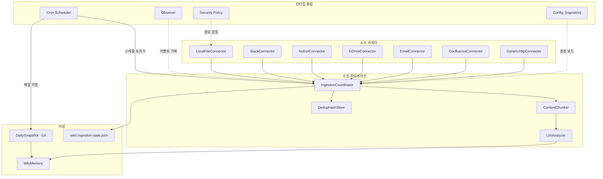
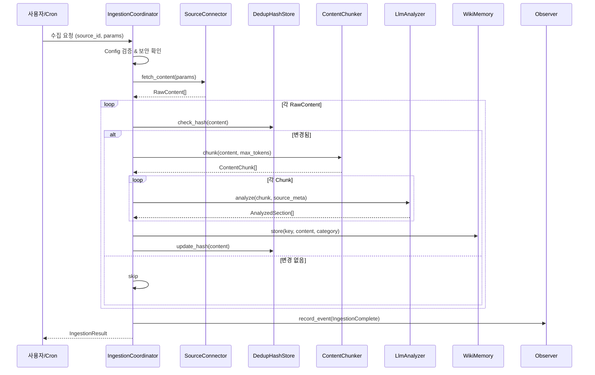
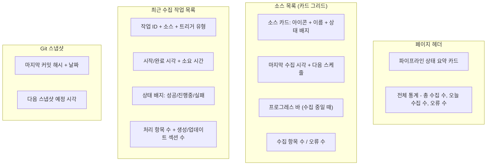

# 설계 문서: Knowledge Ingestion Pipeline

## 개요

`knowledge-ingestion-pipeline`은 NaraeClaw의 지식 수집 파이프라인으로, 다양한 외부 소스(로컬 파일, Slack, Notion, Google Drive, 이메일, Confluence 등)에서 콘텐츠를 수집하고 LLM으로 분석·요약·구조화하여 `WikiMemory` 백엔드(`wiki/` 디렉토리)에 마크다운 파일로 저장한다.

핵심 설계 원칙:
- **명시적 수집만 허용**: 사용자가 지정하거나 `Ingestion_Config`에 등록된 소스만 처리 (자동 크롤링 없음)
- **LLM 기반 정제**: 원본 콘텐츠를 LLM이 주제별로 요약·구조화하여 WikiMemory에 저장
- **증분 처리**: `Dedup_Hash`와 `last_edited_time` 기반으로 변경된 콘텐츠만 재처리
- **기존 채널 재활용**: `naraeclaw-channels`의 Slack, Notion, 이메일 채널 인증 정보를 재사용
- **보안 경계 준수**: `naraeclaw-runtime/security/` 정책에 따른 경로 접근 제어, 인증 토큰 비노출
- **일일 Git 스냅샷**: 매일 자정 `wiki/` 변경사항을 자동 커밋하여 지식 성장 이력 추적

이 기능은 `wiki-memory-backend` 스펙의 `WikiMemory` 백엔드를 저장소로 사용하며, `naraeclaw-runtime`의 cron 스케줄러와 관찰 가능성 시스템에 통합된다.

## 아키텍처



### 데이터 흐름



### 크레이트 배치

| 컴포넌트 | 크레이트 | 이유 |
|---|---|---|
| `IngestionCoordinator` | `naraeclaw-runtime` | 에이전트 루프, cron, 보안 정책과 밀접 |
| `SourceConnector` trait + 구현체 | `naraeclaw-runtime` | 채널 인증 정보 접근, 보안 정책 적용 |
| `LlmAnalyzer` | `naraeclaw-runtime` | Provider 호출 필요 |
| `ContentChunker` | `naraeclaw-runtime` | LLM 컨텍스트 윈도우 관리 |
| `DedupHashStore` | `naraeclaw-runtime` | `wiki/.ingestion-state.json` 관리 |
| `DailySnapshot` | `naraeclaw-runtime` | cron 스케줄러 통합 |
| `IngestionConfig` | `naraeclaw-config` | TOML 설정 스키마 |
| `WikiMemory` 연계 | `naraeclaw-memory` | 기존 `wiki-memory-backend` 스펙 |

## 컴포넌트 및 인터페이스

### 1. `SourceConnector` 트레이트 (`crates/naraeclaw-runtime/src/ingestion/connector.rs`)

```rust
#[async_trait]
pub trait SourceConnector: Send + Sync {
    /// 커넥터 이름 (예: "local", "slack", "notion")
    fn name(&self) -> &str;

    /// 소스에서 원본 콘텐츠를 수집
    async fn fetch(&self, params: &FetchParams) -> Result<Vec<RawContent>>;

    /// 소스 연결 상태 확인
    async fn health_check(&self) -> bool;
}

pub struct FetchParams {
    /// 수집 대상 식별자 (파일 경로, 채널 ID, 페이지 ID 등)
    pub target: String,
    /// 증분 수집 시작 시점 (None이면 전체 수집)
    pub since: Option<DateTime<Utc>>,
    /// 최대 수집 항목 수
    pub max_items: Option<usize>,
    /// 소스별 추가 옵션
    pub options: HashMap<String, String>,
}

pub struct RawContent {
    /// 콘텐츠 고유 식별자 (파일 경로, 메시지 ID 등)
    pub id: String,
    /// 원본 텍스트 콘텐츠
    pub text: String,
    /// 소스 유형
    pub source_type: SourceType,
    /// 콘텐츠 메타데이터 (작성자, 날짜 등)
    pub metadata: ContentMetadata,
    /// SHA-256 해시 (중복 방지용)
    pub content_hash: String,
}
```

### 2. 소스 커넥터 구현체

#### `LocalFileConnector` (`crates/naraeclaw-runtime/src/ingestion/connectors/local.rs`)

```rust
pub struct LocalFileConnector {
    security_policy: Arc<dyn SecurityPolicy>,
    exclude_patterns: Vec<glob::Pattern>,
}
```

- `naraeclaw-runtime/src/security/` 정책으로 허용된 경로만 접근
- 지원 확장자: `.md`, `.txt`, `.rst`, `.org`, `.pdf` (텍스트 레이어)
- 10MB 초과 파일은 `ContentChunker`로 분할
- `exclude_patterns` glob 매칭으로 파일 제외
- SHA-256 `Dedup_Hash` 계산 및 `mtime` 비교로 증분 처리

#### `SlackConnector` (`crates/naraeclaw-runtime/src/ingestion/connectors/slack.rs`)

```rust
pub struct SlackConnector {
    bot_token: String,
    http_client: reqwest::Client,
}
```

- 기존 `SlackChannel`의 봇 토큰을 `naraeclaw-config`의 `channels_config.slack.bot_token`에서 재사용
- `conversations.history` API + cursor 기반 페이지네이션
- `include_threads` 옵션으로 스레드 답글 포함 여부 제어
- HTTP 429 시 `Retry-After` 헤더 기반 대기 후 재시도
- 사용자 ID → 표시 이름 변환 (`users.info` API 캐싱)

#### `NotionConnector` (`crates/naraeclaw-runtime/src/ingestion/connectors/notion.rs`)

```rust
pub struct NotionConnector {
    api_key: String,
    http_client: reqwest::Client,
}
```

- 기존 `NotionChannel`의 API 키를 `naraeclaw-config`의 `channels_config.notion.api_key`에서 재사용
- 페이지: `/v1/blocks/{id}/children` 재귀 수집
- 데이터베이스: `/v1/databases/{id}/query` → 각 페이지 수집
- Notion 블록 타입 → 마크다운 변환 (paragraph, heading, bulleted_list_item, code, table 등)
- `last_edited_time` 비교로 증분 처리
- 실패 시 최대 3회 지수 백오프 (2초 기본 지연)

#### `GDriveConnector` (`crates/naraeclaw-runtime/src/ingestion/connectors/gdrive.rs`)

```rust
pub struct GDriveConnector {
    access_token: String,
    refresh_token: String,
    http_client: reqwest::Client,
}
```

- OAuth 2.0 토큰을 `naraeclaw-config`의 `secrets` 섹션에서 로드
- `files.export` (Google Docs/Sheets/Slides → plain text/markdown)
- `files.list` (폴더 내 파일 열거)
- 토큰 만료 시 리프레시 토큰으로 자동 갱신
- `modifiedTime` 비교로 증분 처리

#### `EmailConnector` (`crates/naraeclaw-runtime/src/ingestion/connectors/email.rs`)

```rust
pub struct EmailConnector {
    imap_config: EmailConfig,
    gmail_oauth: Option<GmailOAuthConfig>,
}
```

- 기존 `EmailChannel`의 IMAP 설정 재사용 (`channels_config.email`)
- Gmail API 설정 존재 시 `GmailPushChannel`의 OAuth 자격증명 재사용
- HTML → plain text 변환 (`EmailChannel::strip_html` 재사용)
- 텍스트 첨부 파일 추출 (`.txt`, `.md`, `.pdf`)
- Message-ID 기반 중복 방지

#### `ConfluenceConnector` (`crates/naraeclaw-runtime/src/ingestion/connectors/confluence.rs`)

```rust
pub struct ConfluenceConnector {
    base_url: String,
    auth: ConfluenceAuth,
    http_client: reqwest::Client,
}
```

- `/rest/api/content` REST API로 페이지 수집
- XHTML 스토리지 형식 → 마크다운 변환
- 기본 인증 또는 API 토큰 (`secrets` 섹션)
- `version.number` / `lastModified` 비교로 증분 처리

#### `GenericHttpConnector` (`crates/naraeclaw-runtime/src/ingestion/connectors/generic_http.rs`)

```rust
pub struct GenericHttpConnector {
    endpoint: String,
    http_client: reqwest::Client,
}
```

- 사용자 지정 HTTP 엔드포인트에서 마크다운/HTML 수집
- `wiki_type = "generic_http"` 설정 시 활성화

### 3. `IngestionCoordinator` (`crates/naraeclaw-runtime/src/ingestion/coordinator.rs`)

```rust
pub struct IngestionCoordinator {
    connectors: HashMap<SourceType, Box<dyn SourceConnector>>,
    analyzer: LlmAnalyzer,
    chunker: ContentChunker,
    dedup_store: DedupHashStore,
    wiki_memory: Arc<dyn Memory>,
    observer: Arc<dyn Observer>,
    config: IngestionConfig,
    running_jobs: Arc<Mutex<HashSet<String>>>,
}

impl IngestionCoordinator {
    /// 단일 수집 작업 실행
    pub async fn run_job(&self, job: &IngestionJob) -> Result<IngestionResult>;

    /// 위키 재정리 계획 생성
    pub async fn plan_refactor(&self) -> Result<RefactorPlan>;

    /// 승인된 재정리 계획 실행
    pub async fn execute_refactor(&self, plan: &RefactorPlan) -> Result<RefactorResult>;

    /// 커넥터 팩토리: 소스 유형에 따라 적절한 커넥터 생성
    fn create_connector(
        source_config: &SourceConfig,
        config: &Config,
    ) -> Result<Box<dyn SourceConnector>>;
}
```

- 동일 소스 동시 실행 방지 (`running_jobs` 뮤텍스)
- 수집 완료 후 `Observer`를 통해 이벤트 기록
- 위키 재정리 시 Git 스냅샷 선행 → 실행 → 실패 시 롤백

### 4. `LlmAnalyzer` (`crates/naraeclaw-runtime/src/ingestion/analyzer.rs`)

```rust
pub struct LlmAnalyzer {
    provider: Arc<dyn Provider>,
    prompt_templates: HashMap<SourceType, String>,
    default_model: Option<String>,
}

pub struct AnalyzedSection {
    /// 위키 섹션 키 (H2 헤더)
    pub key: String,
    /// 구조화된 마크다운 본문
    pub content: String,
    /// 소스 메타데이터 (소스 유형, 수집 날짜)
    pub metadata: SectionMetadata,
}

impl LlmAnalyzer {
    /// 원본 콘텐츠를 분석하여 구조화된 섹션 생성
    pub async fn analyze(
        &self,
        chunk: &ContentChunk,
        source_meta: &ContentMetadata,
    ) -> Result<Vec<AnalyzedSection>>;

    /// 기존 위키 섹션과 새 내용을 병합
    pub async fn merge_sections(
        &self,
        existing: &str,
        new_content: &str,
    ) -> Result<String>;
}
```

- `naraeclaw-providers`의 `Provider` 트레이트를 통해 LLM 호출
- `[ingestion]` 섹션의 모델 설정 사용 (기본값: 에이전트 기본 모델)
- `[ingestion.prompts]` 섹션에서 소스 유형별 프롬프트 템플릿 재정의 가능
- 분석 결과는 `## {주제}` H2 섹션 형식으로 구조화
- 기존 섹션 존재 시 병합 프롬프트로 중복 없이 업데이트

### 5. `ContentChunker` (`crates/naraeclaw-runtime/src/ingestion/chunker.rs`)

```rust
pub struct ContentChunker {
    max_tokens: usize,  // 기본 4,000 토큰 추정
    context_window: usize,  // 기본 128,000 토큰
}

pub struct ContentChunk {
    pub index: usize,
    pub total: usize,
    pub text: String,
    pub source_id: String,
}

impl ContentChunker {
    /// 콘텐츠를 LLM 컨텍스트 윈도우에 맞게 분할
    pub fn chunk(&self, content: &RawContent) -> Vec<ContentChunk>;
}
```

- 문단/줄바꿈 경계에서 분할하여 의미 단위 보존
- 각 청크에 인덱스/전체 수 메타데이터 포함

### 6. `DedupHashStore` (`crates/naraeclaw-runtime/src/ingestion/dedup.rs`)

```rust
pub struct DedupHashStore {
    state_path: PathBuf,  // wiki/.ingestion-state.json
}

#[derive(Serialize, Deserialize)]
pub struct IngestionState {
    /// 소스별 마지막 성공 실행 시각
    pub last_runs: HashMap<String, DateTime<Utc>>,
    /// 콘텐츠 ID → SHA-256 해시 매핑
    pub content_hashes: HashMap<String, String>,
}

impl DedupHashStore {
    /// 콘텐츠 해시가 변경되었는지 확인
    pub fn is_changed(&self, content_id: &str, new_hash: &str) -> Result<bool>;

    /// 해시 업데이트
    pub fn update_hash(&mut self, content_id: &str, hash: &str) -> Result<()>;

    /// 마지막 실행 시각 조회
    pub fn last_run(&self, source_id: &str) -> Option<DateTime<Utc>>;

    /// 마지막 실행 시각 업데이트
    pub fn update_last_run(&mut self, source_id: &str, time: DateTime<Utc>) -> Result<()>;
}
```

- `wiki/.ingestion-state.json` 파일에 상태 영속화
- 매 수집 작업 시 디스크에서 읽고 완료 후 즉시 기록

### 7. `DailySnapshot` (`crates/naraeclaw-runtime/src/ingestion/snapshot.rs`)

```rust
pub struct DailySnapshot {
    wiki_dir: PathBuf,
}

impl DailySnapshot {
    /// Git 변경사항 확인 및 커밋
    pub async fn run(&self) -> Result<SnapshotResult>;
}

pub enum SnapshotResult {
    Committed { hash: String },
    NoChanges,
    GitNotAvailable,
    NotAGitRepo,
}
```

- `std::process::Command`로 로컬 `git` 바이너리 호출
- `git diff --quiet wiki/` → 변경사항 확인
- `git add wiki/` → `git commit -m "[나래] YYYY-MM-DD 일일 지식 스냅샷"`
- cron 스케줄러에 등록 (기본: 매일 자정, `[ingestion.git_snapshot.schedule]`로 재정의 가능)
- `[ingestion.git_snapshot.enabled]`가 `false`이면 등록하지 않음

### 8. 에이전트 컨텍스트 주입 (`crates/naraeclaw-runtime/src/ingestion/context.rs`)

```rust
pub struct WikiContextInjector {
    wiki_memory: Arc<dyn Memory>,
    max_recall_sections: usize,  // 기본 5
    enabled: bool,
}

impl WikiContextInjector {
    /// 사용자 메시지에 관련된 위키 섹션을 검색하여 컨텍스트 문자열 생성
    pub async fn build_context(&self, query: &str) -> Result<Option<String>>;
}
```

- `WikiMemory.recall(query, limit)` 호출로 관련 섹션 검색
- 기존 오케스트레이터의 메모리 recall 흐름(`orchestrator/mod.rs:1844`)과 독립적으로 동작
- `[ingestion.context.enabled]`가 `false`이면 빈 컨텍스트 반환

### 9. 카테고리 매핑 (`crates/naraeclaw-runtime/src/ingestion/category.rs`)

```rust
pub fn resolve_category(
    source_type: &SourceType,
    target_id: &str,
    override_category: Option<&str>,
) -> MemoryCategory;
```

기본 매핑:

| 소스 유형 | 카테고리 |
|---|---|
| `local` | `Custom("local-{folder_name}")` |
| `slack` | `Custom("slack-{channel}")` |
| `notion` | `Custom("notion-{page_title}")` |
| `gdrive` | `Custom("gdrive-{folder_name}")` |
| `email` | `Custom("email-{folder}")` |
| `confluence` | `Custom("confluence-{space_key}")` |
| `generic_http` | `Custom("http-{endpoint_host}")` |

`wiki_category` 설정이 있으면 해당 값으로 오버라이드.

## 데이터 모델

### IngestionConfig (`crates/naraeclaw-config/src/schema/config_types.rs`)

기존 `Config` 구조체에 `ingestion` 필드 추가:

```rust
/// 지식 수집 파이프라인 설정 (`[ingestion]`).
#[serde(default)]
#[nested]
pub ingestion: IngestionConfig,
```

```rust
#[derive(Debug, Clone, Serialize, Deserialize, Configurable)]
pub struct IngestionConfig {
    /// 수집 파이프라인 활성화 여부. Default: false.
    #[serde(default)]
    pub enabled: bool,

    /// 분석에 사용할 LLM 모델 (None이면 에이전트 기본 모델 사용)
    #[serde(default)]
    pub model: Option<String>,

    /// PII 마스킹 활성화 여부. Default: false.
    #[serde(default)]
    pub mask_pii: bool,

    /// 소스별 설정
    #[serde(default)]
    pub sources: HashMap<String, SourceConfig>,

    /// 소스 유형별 프롬프트 템플릿 재정의
    #[serde(default)]
    pub prompts: HashMap<String, String>,

    /// 에이전트 컨텍스트 주입 설정
    #[serde(default)]
    #[nested]
    pub context: IngestionContextConfig,

    /// Git 스냅샷 설정
    #[serde(default)]
    #[nested]
    pub git_snapshot: GitSnapshotConfig,
}

#[derive(Debug, Clone, Serialize, Deserialize, Configurable)]
pub struct SourceConfig {
    /// 소스 유형: "local", "slack", "notion", "gdrive", "email", "confluence", "generic_http"
    pub r#type: String,

    /// 수집 대상 식별자 (파일 경로, 채널 ID, 페이지 ID 등)
    pub target: String,

    /// 소스 활성화 여부. Default: true.
    #[serde(default = "default_true")]
    pub enabled: bool,

    /// cron 표현식 (5필드 형식). None이면 수동 수집만.
    #[serde(default)]
    pub schedule: Option<String>,

    /// 단일 수집 작업 최대 항목 수
    #[serde(default)]
    pub max_items: Option<usize>,

    /// 위키 카테고리 오버라이드
    #[serde(default)]
    pub wiki_category: Option<String>,

    /// 자동 수집 완료 시 알림 전송 여부. Default: false.
    #[serde(default)]
    pub notify_on_complete: bool,

    /// 로컬 파일 제외 패턴 (glob)
    #[serde(default)]
    pub exclude_patterns: Vec<String>,

    /// Slack: 스레드 답글 포함 여부. Default: false.
    #[serde(default)]
    pub include_threads: bool,

    /// 소스별 추가 옵션
    #[serde(default)]
    pub options: HashMap<String, String>,
}

#[derive(Debug, Clone, Serialize, Deserialize, Configurable)]
pub struct IngestionContextConfig {
    /// 위키 컨텍스트 주입 활성화 여부. Default: true.
    #[serde(default = "default_true")]
    pub enabled: bool,

    /// recall 시 반환되는 최대 위키 섹션 수. Default: 5.
    #[serde(default = "default_max_recall_sections")]
    pub max_recall_sections: usize,
}

#[derive(Debug, Clone, Serialize, Deserialize, Configurable)]
pub struct GitSnapshotConfig {
    /// 일일 Git 스냅샷 활성화 여부. Default: true.
    #[serde(default = "default_true")]
    pub enabled: bool,

    /// cron 표현식 오버라이드 (기본: "0 0 * * *" = 매일 자정)
    #[serde(default)]
    pub schedule: Option<String>,
}
```

### TOML 설정 예시

```toml
[ingestion]
enabled = true
model = "anthropic/claude-sonnet-4-6"
mask_pii = false

[ingestion.context]
enabled = true
max_recall_sections = 5

[ingestion.git_snapshot]
enabled = true
# schedule = "0 3 * * *"  # 새벽 3시로 변경 가능

[ingestion.sources.my-notes]
type = "local"
target = "/home/user/notes"
schedule = "0 6 * * *"
exclude_patterns = ["*.tmp", ".git/**"]
wiki_category = "personal-notes"

[ingestion.sources.team-slack]
type = "slack"
target = "C01234ABCDE"
schedule = "0 */6 * * *"
include_threads = true
notify_on_complete = true

[ingestion.sources.project-wiki]
type = "notion"
target = "abc123def456"
schedule = "0 0 * * 1"
max_items = 100

[ingestion.sources.work-docs]
type = "gdrive"
target = "folder_id_here"
schedule = "0 2 * * *"

[ingestion.sources.inbox]
type = "email"
target = "INBOX"
schedule = "0 */4 * * *"
max_items = 50

[ingestion.sources.confluence-space]
type = "confluence"
target = "TEAM"
options = { base_url = "https://myco.atlassian.net/wiki" }
```

### IngestionJob

```rust
pub struct IngestionJob {
    pub job_id: String,
    pub source_id: String,
    pub source_config: SourceConfig,
    pub triggered_by: TriggerType,
    pub created_at: DateTime<Utc>,
}

pub enum TriggerType {
    Manual,
    Scheduled,
}
```

### IngestionResult

```rust
pub struct IngestionResult {
    pub job_id: String,
    pub source_id: String,
    pub items_processed: usize,
    pub sections_created: usize,
    pub sections_updated: usize,
    pub errors: Vec<IngestionError>,
    pub duration: Duration,
}
```

### SourceType

```rust
#[derive(Debug, Clone, PartialEq, Eq, Hash, Serialize, Deserialize)]
pub enum SourceType {
    Local,
    Slack,
    Notion,
    GDrive,
    Email,
    Confluence,
    GenericHttp,
}
```

### ObserverEvent 확장

기존 `ObserverEvent` enum에 수집 관련 이벤트 추가:

```rust
pub enum ObserverEvent {
    // ... 기존 이벤트 ...
    
    /// 수집 작업 시작
    IngestionStarted {
        source_id: String,
        source_type: String,
        trigger: String,
    },
    /// 수집 작업 완료
    IngestionCompleted {
        source_id: String,
        items_processed: usize,
        sections_created: usize,
        sections_updated: usize,
        duration_ms: u64,
    },
    /// 수집 작업 실패
    IngestionFailed {
        source_id: String,
        error: String,
    },
    /// 일일 스냅샷 결과
    DailySnapshotResult {
        committed: bool,
        commit_hash: Option<String>,
    },
}
```

### 웹 대시보드 UI 컴포넌트

수집 파이프라인 상태를 모니터링하는 웹 대시보드 페이지를 추가한다. 기존 NaraeClaw 웹 대시보드(`web/src/pages/Dashboard.tsx`)의 디자인 시스템을 따르며, Dribbble 수준의 세련된 UI를 구현한다.

#### `IngestionPage` (`web/src/pages/Ingestion.tsx`)



디자인 가이드라인:
- 다크 모드 우선: 기존 `--pc-*` CSS 변수 시스템 활용
- 소스별 아이콘: Slack(#4A154B), Notion(#000000), Google Drive(#0066DA), Email(#EA4335), Confluence(#0052CC), 로컬 파일(폴더 아이콘)
- 상태 배지: 성공(`--color-status-success`, 녹색), 진행중(`--color-status-warning`, 노란색), 오류(`--color-status-error`, 빨간색)
- 카드 레이아웃: `rounded-2xl`, `card` 클래스, 호버 시 `translateY(-2px)` + `boxShadow` 효과
- 프로그레스 바: `progress-bar-animated` 클래스, 수집 진행률 시각화
- 스텝 인디케이터: 수집 → 분석 → 저장 단계를 시각적으로 표시
- 부드러운 전환: `transition-all`, `animate-slide-in-up`, `stagger-children`
- SSE 실시간 업데이트: `useSSE` 훅으로 수집 상태 변경 실시간 반영

