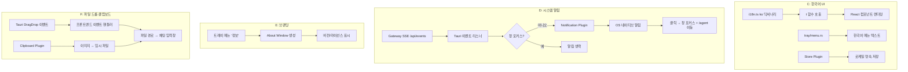

# 설계 문서: NaraeClaw V2 데스크탑 완성

## 개요

이 설계 문서는 NaraeClaw V2 데스크탑 앱의 미완성 4개 기능(C: 한국어 UI, D: 시스템 알림, E: 브랜딩 마무리, F: 파일 드롭·클립보드)을 완성하기 위한 기술 설계를 정의한다.

현재 상태:
- Tauri 2.0 셸(`apps/tauri/`)은 sidecar 번들링, 창 관리, 트레이 메뉴, 헬스 폴링이 구현됨
- React 19 프론트엔드(`web/src/`)는 i18n(31개 로케일), 라우팅, 테마 시스템이 구현됨
- Gateway sidecar(`crates/naraeclaw-gateway/`)는 SSE 이벤트 브로드캐스트, WebSocket 세션 관리가 구현됨

설계 원칙:
1. 기존 아키텍처(Tauri ↔ Gateway HTTP/WS)를 변경하지 않고 확장
2. Tauri 플러그인 생태계 활용 (notification, clipboard, drag-drop)
3. 프론트엔드 변경은 기존 i18n/테마 패턴을 따름
4. Rust 사이드 변경은 최소화하고, 가능하면 프론트엔드에서 처리

## 아키텍처

### 전체 구조

```
사용자 → Tauri 트레이 앱 (WebView)
           ├── React 프론트엔드 (i18n, 테마, 라우팅)
           ├── Tauri Commands (IPC)
           ├── Tauri Plugins (notification, clipboard, drag-drop, store)
           └── HTTP/WS → Gateway sidecar (Axum + 에이전트 런타임)
```

### 기능별 데이터 흐름



## 컴포넌트 및 인터페이스

### C: 한국어 UI 완전 적용

#### 변경 대상 파일

| 파일 | 변경 내용 |
|------|-----------|
| `web/src/lib/i18n.ts` | `ko` 딕셔너리 누락 키 보충, `en` 딕셔너리와 키 동기화 |
| `web/src/contexts/ThemeContext.tsx` | `loadLocale()` 기본값 `'ko'` 확인 (이미 구현됨) |
| `apps/tauri/src/tray/menu.rs` | 메뉴 텍스트 한국어화 |
| `web/src/App.tsx` | 로케일 초기값 `'ko'` 확인 (이미 구현됨) |

#### 트레이 메뉴 한국어화

현재 `menu.rs`의 영어 텍스트를 한국어로 변경:

```rust
// 변경 전
MenuItemBuilder::with_id("show", "Show Dashboard")
MenuItemBuilder::with_id("chat", "Agent Chat")
MenuItemBuilder::with_id("status", "Status: Checking...")
MenuItemBuilder::with_id("quit", "Quit NaraeClaw")

// 변경 후
MenuItemBuilder::with_id("show", "대시보드 열기")
MenuItemBuilder::with_id("chat", "에이전트 채팅")
MenuItemBuilder::with_id("status", "상태: 확인 중...")
MenuItemBuilder::with_id("quit", "NaraeClaw 종료")
```

#### i18n 폴백 메커니즘

기존 `t()` 함수가 이미 `ko → en → key` 폴백 체인을 구현하고 있음:
```typescript
export function t(key: string): string {
  return translations[currentLocale]?.[key] ?? translations.en[key] ?? key;
}
```

작업: `en` 딕셔너리의 모든 키가 `ko` 딕셔너리에도 존재하는지 검증하고 누락 키를 보충한다.

### D: 시스템 알림

#### 의존성 추가

```toml
# apps/tauri/Cargo.toml
tauri-plugin-notification = "2.2"
```

#### 알림 아키텍처

알림은 Tauri 사이드(Rust)에서 처리한다. Gateway SSE 스트림을 구독하여 메시지 이벤트를 감지하고, 창이 포커스 상태가 아닐 때만 네이티브 알림을 발송한다.

```rust
// apps/tauri/src/notifications.rs (신규)

/// Gateway SSE 스트림에서 메시지 이벤트를 수신하여 알림 발송
pub fn spawn_notification_listener<R: Runtime>(
    app: AppHandle<R>,
    state: SharedState,
)
```

핵심 로직:
1. Gateway의 `/api/events` SSE 엔드포인트를 `reqwest-eventsource` 또는 수동 SSE 파싱으로 구독
2. `type: "message"` 또는 Telegram 관련 이벤트 수신 시 알림 트리거
3. 창 포커스 상태 확인: `window.is_focused()` — 포커스 중이면 알림 생략
4. 알림 본문: 메시지 텍스트 앞 100자 + 초과 시 "…" 추가
5. 알림 클릭 시: `show_main_window(app, Some("/agent"))` 호출

#### 알림 본문 잘라내기 로직

```rust
fn truncate_notification_body(text: &str, max_chars: usize) -> String {
    if text.chars().count() <= max_chars {
        text.to_string()
    } else {
        let truncated: String = text.chars().take(max_chars).collect();
        format!("{truncated}…")
    }
}
```

#### 권한 처리

Tauri 2.0의 `tauri-plugin-notification`은 각 OS별 권한을 자동 처리한다:
- macOS: 첫 알림 시 시스템 권한 요청 다이얼로그 자동 표시
- Windows: 별도 권한 불필요
- Linux: `libnotify` 기반, 별도 권한 불필요

플러그인 초기화 실패 시 `tracing::warn!`으로 로그 기록 후 정상 동작 계속.

#### Capabilities 추가

```json
// apps/tauri/capabilities/desktop.json
{
  "permissions": [
    // ... 기존 권한 ...
    "notification:default"
  ]
}
```

### E: 앱 브랜딩 마무리

#### About Window

트레이 메뉴에 "NaraeClaw 정보" 항목을 추가하고, 클릭 시 별도 창을 생성한다.

```rust
// apps/tauri/src/tray/events.rs — 이벤트 핸들러 추가
"about" => show_about_window(app),
```

About Window 구현 방식: Tauri의 `WebviewWindowBuilder`로 별도 창을 생성하고, 인라인 HTML을 로드한다.

```rust
fn show_about_window<R: Runtime>(app: &AppHandle<R>) {
    // 이미 열려 있으면 포커스만
    if let Some(window) = app.get_webview_window("about") {
        let _ = window.set_focus();
        return;
    }
    // 새 창 생성: 400x300, 리사이즈 불가
    let html = format!(
        r#"<html>...</html>"#,
        version = env!("CARGO_PKG_VERSION"), // 또는 tauri.conf.json에서 읽기
    );
    WebviewWindowBuilder::new(app, "about", WebviewUrl::CustomProtocol(...))
        .title("NaraeClaw 정보")
        .inner_size(400.0, 300.0)
        .resizable(false)
        .build();
}
```

#### 트레이 메뉴 변경

```rust
// menu.rs에 about 항목 추가
let about = MenuItemBuilder::with_id("about", "NaraeClaw 정보").build(app)?;
// quit 앞에 삽입
Menu::with_items(app, &[&show, &chat, &sep1, &status, &sep2, &about, &quit])
```

#### 브랜딩 일관성 검증

- `tauri.conf.json`: `productName: "NaraeClaw"`, `identifier: "ai.naraeclaw.desktop"` 유지 확인
- 사이드바 로고: `Sidebar.tsx`에서 "NaraeClaw" 텍스트 확인 (이미 구현됨)
- 페어링 화면: `App.tsx`에서 "NaraeClaw" 텍스트 확인 (이미 구현됨)
- 브라우저 탭 제목: `index.html`의 `<title>` 태그 확인

### F: 파일 드롭 및 클립보드 지원

#### 의존성 추가

```toml
# apps/tauri/Cargo.toml
tauri-plugin-clipboard-manager = "2.2"
```

Tauri 2.0은 파일 드롭 이벤트를 코어에서 지원하므로 별도 드롭 플러그인은 불필요하다. `tauri::DragDropEvent`를 `WebviewWindow`의 `on_drag_drop_event` 핸들러로 수신한다.

#### 파일 드롭 처리

```rust
// apps/tauri/src/lib.rs — setup 내부
window.on_drag_drop_event(move |_window, event| {
    match event {
        DragDropEvent::Drop { paths, .. } => {
            // 최대 10개 파일 제한
            let paths: Vec<_> = paths.iter().take(10).collect();
            let exceeded = paths.len() < original_count;
            // 프론트엔드로 이벤트 전송
            app_handle.emit("naraeclaw://file-drop", FileDropPayload { paths, exceeded });
        }
        _ => {}
    }
});
```

#### 프론트엔드 파일 드롭 핸들러

```typescript
// web/src/pages/AgentChat.tsx
import { listen } from '@tauri-apps/api/event';

useEffect(() => {
  const unlisten = listen<FileDropPayload>('naraeclaw://file-drop', (event) => {
    if (location.pathname !== '/agent') return;
    const { paths, exceeded } = event.payload;
    // 기존 입력 보존, 파일 경로를 줄바꿈으로 추가
    setInput(prev => {
      const prefix = prev.endsWith('\n') || prev === '' ? prev : prev + '\n';
      return prefix + paths.join('\n');
    });
    if (exceeded) showToast('파일은 최대 10개까지 첨부할 수 있습니다.');
  });
  return () => { unlisten.then(fn => fn()); };
}, []);
```

#### 클립보드 이미지 붙여넣기

클립보드에서 이미지 데이터를 감지하면 Tauri 커맨드를 통해 임시 파일로 저장하고 경로를 반환한다.

```typescript
// AgentChat.tsx — onPaste 핸들러
const handlePaste = async (e: React.ClipboardEvent) => {
  const items = e.clipboardData?.items;
  if (!items) return;
  for (const item of items) {
    if (item.type.startsWith('image/')) {
      e.preventDefault();
      const blob = item.getAsFile();
      if (!blob) continue;
      const arrayBuffer = await blob.arrayBuffer();
      const bytes = Array.from(new Uint8Array(arrayBuffer));
      // Tauri 커맨드로 임시 파일 저장
      const path = await invoke<string>('save_clipboard_image', { bytes });
      setInput(prev => prev + (prev ? '\n' : '') + path);
    }
  }
};
```

```rust
// apps/tauri/src/commands/clipboard.rs (신규)
#[tauri::command]
pub async fn save_clipboard_image(bytes: Vec<u8>) -> Result<String, String> {
    let tmp_dir = std::env::temp_dir().join("naraeclaw");
    std::fs::create_dir_all(&tmp_dir).map_err(|e| e.to_string())?;
    let filename = format!("clipboard_{}.png", chrono::Utc::now().timestamp_millis());
    let path = tmp_dir.join(&filename);
    std::fs::write(&path, &bytes).map_err(|e| e.to_string())?;
    Ok(path.to_string_lossy().to_string())
}
```

#### Capabilities 추가

```json
// apps/tauri/capabilities/desktop.json
{
  "permissions": [
    // ... 기존 권한 ...
    "notification:default",
    "clipboard-manager:allow-read-image",
    "clipboard-manager:allow-write-text"
  ]
}
```

#### 오류 처리

- 드롭된 파일이 존재하지 않거나 읽기 권한이 없으면: Rust 사이드에서 `Path::exists()` + `Path::metadata()` 검증 후 유효한 파일만 프론트엔드로 전달, 오류 파일은 별도 에러 이벤트로 전송
- 프론트엔드에서 토스트 알림으로 오류 표시
- 다른 페이지에서의 드롭: 기본 브라우저 드롭 동작 방지 (`e.preventDefault()`)

## 데이터 모델

### 이벤트 페이로드

```typescript
// 파일 드롭 이벤트
interface FileDropPayload {
  paths: string[];      // 유효한 파일 절대 경로 목록 (최대 10개)
  exceeded: boolean;    // 10개 초과 파일이 있었는지
  errors?: string[];    // 접근 불가 파일 경로 목록
}

// 알림 이벤트 (Gateway SSE → Tauri)
interface NotificationEvent {
  type: 'message';
  content: string;      // 메시지 텍스트
  channel?: string;     // 채널 이름 (e.g., "telegram")
  timestamp: string;    // ISO 8601
}
```

### 상태 확장

```rust
// apps/tauri/src/state.rs — AppState에 필드 추가
pub struct AppState {
    // ... 기존 필드 ...
    pub notifications_enabled: bool,  // 알림 활성화 여부
}
```

### About Window 데이터

```rust
struct AboutInfo {
    name: &'static str,       // "NaraeClaw"
    version: String,          // tauri.conf.json version
    license: &'static str,    // "Apache-2.0 / MIT"
    copyright: &'static str,  // "© 2024-2026 NaraeClaw Contributors"
}
```

### 로케일 저장

기존 `localStorage` 기반 저장 유지 (`naraeclaw-locale` 키). Tauri Store Plugin과의 동기화는 선택적 — 현재 WebView localStorage가 Tauri 앱 내에서 영속되므로 추가 동기화 불필요.


## 정확성 속성 (Correctness Properties)

*속성(property)이란 시스템의 모든 유효한 실행에서 참이어야 하는 특성 또는 동작이다. 사람이 읽을 수 있는 명세와 기계가 검증할 수 있는 정확성 보장 사이의 다리 역할을 한다.*

### Property 1: ko 딕셔너리 완전성

*For any* 번역 키 `key`가 `ko` 딕셔너리에 정의되어 있으면, `t(key)`를 로케일 `ko`로 호출했을 때 빈 문자열이 아닌 번역 값을 반환해야 하며, 그 값은 키 자체와 달라야 한다.

**Validates: Requirements 1.3**

### Property 2: en 폴백 메커니즘

*For any* 번역 키 `key`가 `en` 딕셔너리에 존재하지만 현재 로케일 딕셔너리에 존재하지 않으면, `t(key)`는 `en` 딕셔너리의 해당 값을 반환해야 한다.

**Validates: Requirements 1.4**

### Property 3: 로케일 영속 저장 라운드트립

*For any* 지원되는 로케일 코드 `locale`에 대해, `saveLocale(locale)` 후 `loadLocale()`를 호출하면 동일한 `locale` 값을 반환해야 한다.

**Validates: Requirements 1.6**

### Property 4: 알림 본문 잘라내기

*For any* 문자열 `text`에 대해, `truncate_notification_body(text, 100)`의 결과는 다음을 만족해야 한다:
- `text`가 100자 이하이면 결과는 `text`와 동일
- `text`가 100자 초과이면 결과는 정확히 100자 + "…"이며, 결과의 앞 100자는 `text`의 앞 100자와 동일

**Validates: Requirements 2.3, 2.4**

### Property 5: 파일 경로 삽입 시 기존 텍스트 보존

*For any* 기존 입력 텍스트 `existing`과 1~10개의 파일 경로 목록 `paths`에 대해, 파일 경로 삽입 결과는 다음을 만족해야 한다:
- 결과 문자열이 `existing`으로 시작
- `paths`의 모든 경로가 결과 문자열에 포함
- 경로들은 줄바꿈(`\n`)으로 구분

**Validates: Requirements 4.1, 4.6**

### Property 6: 파일 개수 제한

*For any* N개의 파일 경로 목록(N > 10)에 대해, 처리 결과는 정확히 10개의 경로만 포함하며, 초과 플래그(`exceeded`)가 `true`여야 한다.

**Validates: Requirements 4.5**

## 오류 처리

### 알림 시스템 오류

| 오류 상황 | 처리 방식 |
|-----------|-----------|
| Notification Plugin 초기화 실패 | `tracing::warn!` 로그 기록, 알림 없이 정상 동작 계속 |
| OS 알림 권한 거부 | 알림 발송 시도 시 조용히 실패, 로그 기록 |
| Gateway SSE 연결 끊김 | 헬스 폴러가 재연결 시도, 알림 리스너도 재시작 |

### 파일 드롭 오류

| 오류 상황 | 처리 방식 |
|-----------|-----------|
| 드롭된 파일 존재하지 않음 | 토스트 알림으로 오류 표시, 해당 파일 경로 제외 |
| 파일 읽기 권한 없음 | 토스트 알림으로 오류 표시, 해당 파일 경로 제외 |
| 10개 초과 파일 드롭 | 처음 10개만 처리, 초과 사실 토스트 알림 |
| 클립보드 이미지 저장 실패 | 토스트 알림으로 오류 표시, 입력창 변경 없음 |

### i18n 오류

| 오류 상황 | 처리 방식 |
|-----------|-----------|
| 번역 키 누락 (ko) | `en` 폴백 반환 |
| 번역 키 누락 (ko + en) | 키 문자열 자체 반환 |
| localStorage 접근 실패 | 기본 로케일 `ko` 사용 |

### 브랜딩 오류

| 오류 상황 | 처리 방식 |
|-----------|-----------|
| About Window 생성 실패 | `tracing::error!` 로그 기록, 앱 정상 동작 계속 |
| 로고 이미지 로드 실패 | `onError` 핸들러로 이미지 숨김 (기존 구현) |

## 테스팅 전략

### 단위 테스트 (Unit Tests)

| 테스트 대상 | 테스트 내용 | 파일 |
|-------------|-------------|------|
| `truncate_notification_body` | 100자 이하/초과 문자열 잘라내기 | `apps/tauri/src/notifications.rs` |
| `save_clipboard_image` | 바이트 배열 → 임시 파일 저장 | `apps/tauri/src/commands/clipboard.rs` |
| 트레이 메뉴 텍스트 | 한국어 메뉴 항목 확인 | `apps/tauri/src/tray/menu.rs` |
| About Window 싱글턴 | 중복 창 방지 로직 | `apps/tauri/src/tray/events.rs` |
| `tauri.conf.json` 브랜딩 | productName, identifier 값 확인 | 설정 파일 파싱 테스트 |

### 속성 기반 테스트 (Property-Based Tests)

속성 기반 테스트 라이브러리: TypeScript 측은 `fast-check`, Rust 측은 `proptest` 사용.

| 속성 | 라이브러리 | 최소 반복 | 태그 |
|------|-----------|-----------|------|
| Property 1: ko 딕셔너리 완전성 | fast-check | 100 | Feature: naraeclaw-v2-desktop, Property 1: ko dictionary completeness |
| Property 2: en 폴백 메커니즘 | fast-check | 100 | Feature: naraeclaw-v2-desktop, Property 2: en fallback mechanism |
| Property 3: 로케일 라운드트립 | fast-check | 100 | Feature: naraeclaw-v2-desktop, Property 3: locale persistence round-trip |
| Property 4: 알림 본문 잘라내기 | proptest | 100 | Feature: naraeclaw-v2-desktop, Property 4: notification body truncation |
| Property 5: 파일 경로 삽입 | fast-check | 100 | Feature: naraeclaw-v2-desktop, Property 5: file path insertion preserves text |
| Property 6: 파일 개수 제한 | fast-check | 100 | Feature: naraeclaw-v2-desktop, Property 6: file count limit |

### 통합 테스트 (Integration Tests)

| 테스트 대상 | 테스트 내용 |
|-------------|-------------|
| 알림 파이프라인 | Mock SSE 이벤트 → 알림 발송 확인 |
| 클립보드 이미지 | Mock 클립보드 데이터 → 임시 파일 생성 확인 |
| 크로스 플랫폼 알림 | macOS/Windows/Linux CI 매트릭스 |

### 스모크 테스트 (Smoke Tests)

| 테스트 대상 | 테스트 내용 |
|-------------|-------------|
| `tauri.conf.json` 브랜딩 | productName, identifier 값 확인 |
| Capabilities 권한 | notification, clipboard 권한 선언 확인 |
| About Window 크기 | 400x300, resizable=false 확인 |
