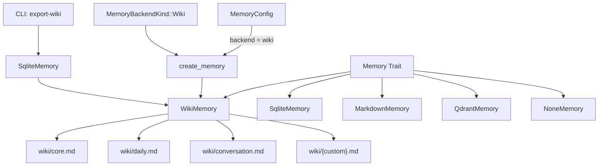

# 설계 문서: Wiki Memory Backend

## 개요

`WikiMemory`는 NaraeClaw의 새로운 메모리 백엔드로, `wiki/` 디렉토리 아래 주제별 마크다운 파일에 지식을 구조화하여 저장한다. Andrej Karpathy가 제안한 위키 기반 지식 보관소 패턴을 구현하며, 벡터 임베딩 없이 에이전트가 파일 전체를 LLM 컨텍스트로 직접 읽고 H2 섹션 단위로 편집할 수 있게 한다.

핵심 설계 원칙:
- **캐시 없는 디스크 직접 읽기**: 사람이 텍스트 편집기로 수정한 내용이 즉시 반영됨
- **H2 섹션 단위 CRUD**: 각 메모리 항목은 `## key` 헤더와 본문으로 구성
- **카테고리 → 파일 매핑**: `MemoryCategory`가 위키 파일명을 결정
- **기존 백엔드 무간섭**: `backend = "wiki"` 설정으로만 활성화, 기존 백엔드에 영향 없음

## 아키텍처



`WikiMemory`는 기존 `Memory` 트레이트를 구현하며, `naraeclaw-memory` 크레이트 내 `wiki.rs` 모듈로 추가된다. 팩토리 함수 `create_memory()`에 `"wiki"` 분기를 추가하고, `MemoryBackendKind`에 `Wiki` variant를 추가한다.

## 컴포넌트 및 인터페이스

### 1. `WikiMemory` 구조체 (`crates/naraeclaw-memory/src/wiki.rs`)

```rust
pub struct WikiMemory {
    wiki_dir: PathBuf,
}
```

- `wiki_dir`: 위키 파일이 저장되는 디렉토리 경로 (기본값: `{workspace}/wiki/`)
- 인메모리 캐시 없음 — 모든 읽기 연산은 디스크에서 직접 수행

주요 내부 함수:
- `category_to_filename(category: &MemoryCategory) -> String`: 카테고리를 파일명으로 매핑
- `sanitize_key(key: &str) -> String`: 파일 시스템 안전하지 않은 문자를 `_`로 치환
- `parse_wiki_file(content: &str) -> Vec<WikiSection>`: 마크다운 파일을 H2 섹션으로 파싱
- `render_wiki_file(title: &str, sections: &[WikiSection]) -> String`: 섹션 목록을 마크다운으로 렌더링

### 2. `MemoryBackendKind::Wiki` (`crates/naraeclaw-memory/src/backend.rs`)

```rust
pub enum MemoryBackendKind {
    Sqlite,
    Lucid,
    Qdrant,
    Markdown,
    Wiki,      // 새로 추가
    None,
    Unknown,
}
```

`classify_memory_backend("wiki")`가 `MemoryBackendKind::Wiki`를 반환하도록 매치 분기 추가.

`WIKI_PROFILE` 상수와 `selectable_memory_backends()`에 Wiki 프로파일 추가:

```rust
const WIKI_PROFILE: MemoryBackendProfile = MemoryBackendProfile {
    key: "wiki",
    label: "Wiki Files — topic-based markdown, human-editable, no embeddings",
    auto_save_default: true,
    uses_sqlite_hygiene: false,
    sqlite_based: false,
    optional_dependency: false,
};
```

### 3. 팩토리 통합 (`crates/naraeclaw-memory/src/lib.rs`)

`create_memory_with_builders()`에 `MemoryBackendKind::Wiki` 분기 추가:

```rust
MemoryBackendKind::Wiki => {
    let wiki_dir = workspace_dir.join("wiki");
    Ok(Box::new(WikiMemory::new(&wiki_dir)))
}
```

`MemoryConfig`에 `wiki_dir` 옵션 필드가 설정된 경우 해당 경로를 사용.

### 4. 설정 확장 (`crates/naraeclaw-config/src/schema/config_types.rs`)

`MemoryConfig`에 `wiki_dir` 필드 추가:

```rust
/// Custom wiki directory path (relative to workspace root).
/// Only used when `backend = "wiki"`. Default: "wiki".
#[serde(default)]
pub wiki_dir: Option<String>,
```

### 5. CLI 서브커맨드 (`src/main.rs`)

`MemoryCommands`에 `ExportWiki` variant 추가:

```rust
/// SQLite 메모리를 위키 형식으로 내보내기
ExportWiki {
    /// 실제 파일을 생성하지 않고 내보낼 항목만 출력
    #[arg(long)]
    dry_run: bool,
},
```

## 데이터 모델

### 위키 파일 구조

```markdown
# Core

## 사용자 선호 언어

한국어를 선호합니다.

## 프로젝트 스택

Rust + Tauri + React
```

- 첫 줄: `# {카테고리명}` (H1 헤더, 파일당 정확히 1개)
- 각 섹션: `## {key}` (H2 헤더) + 본문 텍스트
- 섹션 간 빈 줄로 구분

### 카테고리 → 파일명 매핑

| MemoryCategory | 파일명 |
|---|---|
| `Core` | `wiki/core.md` |
| `Daily` | `wiki/daily.md` |
| `Conversation` | `wiki/conversation.md` |
| `Custom("projects")` | `wiki/projects.md` |

### WikiSection 내부 구조

```rust
struct WikiSection {
    key: String,       // H2 헤더 텍스트 (sanitized)
    content: String,   // 본문 텍스트
}
```

### 키 새니타이징 규칙

파일 시스템 안전하지 않은 문자 (`/`, `\`, `:`, `*`, `?`, `"`, `<`, `>`, `|`)를 `_`로 치환.

```rust
fn sanitize_key(key: &str) -> String {
    key.chars()
        .map(|c| match c {
            '/' | '\\' | ':' | '*' | '?' | '"' | '<' | '>' | '|' => '_',
            _ => c,
        })
        .collect()
}
```

### MemoryEntry 변환

위키 섹션 → `MemoryEntry` 변환 시:
- `id`: `"{filename}:{section_index}"` (예: `"core:0"`)
- `key`: H2 헤더 텍스트
- `content`: 섹션 본문
- `category`: 파일명에서 역매핑
- `timestamp`: 파일의 수정 시간 (RFC 3339)
- `namespace`: `"default"`


## 정확성 속성 (Correctness Properties)

*속성(property)은 시스템의 모든 유효한 실행에서 참이어야 하는 특성 또는 동작이다. 사람이 읽을 수 있는 명세와 기계가 검증할 수 있는 정확성 보장 사이의 다리 역할을 한다.*

### Property 1: 카테고리 → 파일 매핑 일관성

*For any* `MemoryCategory`와 임의의 key/content에 대해, `store(key, content, category)` 호출 후 해당 카테고리에 대응하는 위키 파일(`category_to_filename(category)`)에 `## {sanitize_key(key)}` 섹션이 존재해야 한다.

**Validates: Requirements 1.2, 1.3, 1.4, 1.5**

### Property 2: 위키 파일 구조 불변식

*For any* 일련의 `store` 연산 후, 모든 위키 파일은 유효한 마크다운 구조를 유지해야 한다: 첫 줄은 `# ` 로 시작하는 H1 헤더이고, 이후 0개 이상의 `## ` H2 섹션이 존재하며, 동일 key의 H2 섹션은 파일 내에서 최대 1개여야 한다.

**Validates: Requirements 1.6, 1.7, 1.8, 3.4**

### Property 3: Store → Recall 라운드트립

*For any* 임의의 key와 content에 대해, `store(key, content, category)` 후 `recall(key, limit, ...)` 결과에 `entry.key == sanitize_key(key)` 이고 `entry.content == content`인 항목이 포함되어야 한다 (limit이 충분히 클 때).

**Validates: Requirements 2.1, 2.2, 2.6, 2.7, 3.1, 3.3**

### Property 4: Recall Limit 상한

*For any* `limit ≥ 0`과 임의의 쿼리에 대해, `recall(query, limit, ...)` 결과의 길이는 항상 `limit` 이하여야 한다.

**Validates: Requirements 2.3**

### Property 5: Store 멱등성 (단일 섹션 보장)

*For any* 임의의 key, content, category에 대해, 동일한 `(key, category)`로 `store`를 N번 (N ≥ 1) 호출한 후 해당 위키 파일에서 `## {sanitize_key(key)}` H2 섹션은 정확히 1개여야 하며, 그 내용은 마지막 store의 content와 동일해야 한다.

**Validates: Requirements 3.2**

### Property 6: 키 새니타이징

*For any* 파일 시스템 안전하지 않은 문자(`/`, `\`, `:`, `*`, `?`, `"`, `<`, `>`, `|`)를 포함하는 임의의 key에 대해, `store` 후 위키 파일의 H2 헤더에는 해당 안전하지 않은 문자가 존재하지 않고 모두 `_`로 치환되어야 한다.

**Validates: Requirements 3.5**

### Property 7: Store → Forget → Get 라운드트립

*For any* 임의의 key와 content에 대해, `store(key, content, category)` 후 `forget(key)`를 호출하면 `forget`은 `true`를 반환하고, 이후 `get(key)`는 `None`을 반환해야 한다. 또한 forget 후에도 위키 파일은 유효한 마크다운 구조(H1 헤더 유지)를 유지해야 한다.

**Validates: Requirements 4.1, 4.2, 4.4, 4.5**

### Property 8: 마이그레이션 내용 보존

*For any* 임의의 SQLite 메모리 항목 집합에 대해, `export-wiki` 마이그레이션 후 각 항목의 `key`와 `content`가 대응하는 위키 파일에 섹션으로 존재해야 한다. 기존 위키 파일에 이미 존재하는 섹션은 보존되어야 한다.

**Validates: Requirements 7.2, 7.4**

### Property 9: 외부 편집 즉시 반영 (캐시 없음)

*For any* `store(key, content, category)` 후 위키 파일을 외부에서 직접 수정하여 해당 섹션의 content를 `new_content`로 변경하면, 이후 `recall(key, ...)` 또는 `get(key)` 결과의 content는 `new_content`여야 한다.

**Validates: Requirements 8.1, 8.2**

### Property 10: 외부 콘텐츠 보존

*For any* 위키 파일에 에이전트가 생성하지 않은 추가 마크다운 콘텐츠(H2 섹션 외의 텍스트, 코드 블록, 주석 등)가 있을 때, `store` 또는 `forget` 연산 후에도 해당 추가 콘텐츠는 변경 없이 보존되어야 한다.

**Validates: Requirements 8.3**

## 오류 처리

| 상황 | 처리 방식 |
|---|---|
| `wiki/` 디렉토리 생성 실패 | `anyhow::Error` 반환, 폴백 없음 |
| 위키 파일 읽기 실패 (권한) | `anyhow::Error` 반환 |
| 위키 파일이 외부에서 삭제됨 | 빈 결과 반환 (오류 아님) |
| 위키 파일 쓰기 실패 | `anyhow::Error` 반환 |
| 잘못된 마크다운 구조 (H1 없음) | 파싱 시 빈 섹션 목록 반환, 쓰기 시 H1 헤더 자동 추가 |
| `Custom` 카테고리명에 안전하지 않은 문자 | 파일명에서 안전하지 않은 문자를 `_`로 치환 |
| `forget` 시 키가 존재하지 않음 | `false` 반환 |
| 마이그레이션 중 개별 항목 변환 실패 | 경고 출력 후 건너뛰기, 나머지 계속 처리 |
| `health_check` 시 `wiki_dir` 존재하지 않음 | `false` 반환 |

## 테스팅 전략

### Property-Based Testing (PBT)

이 기능은 순수 함수적 로직(파싱, 렌더링, 매핑, 라운드트립)이 풍부하여 PBT에 적합하다.

**라이브러리**: `proptest` (Rust 생태계 표준 PBT 라이브러리)

**설정**:
- 각 property 테스트는 최소 100회 반복
- 각 테스트에 설계 문서의 property 번호를 태그로 주석
- 태그 형식: `// Feature: wiki-memory-backend, Property {N}: {title}`

**Property 테스트 목록**:

| Property | 테스트 대상 | 생성기 |
|---|---|---|
| 1: 카테고리 → 파일 매핑 | `store` 후 파일 존재 확인 | 임의의 `MemoryCategory`, key, content |
| 2: 파일 구조 불변식 | 연속 `store` 후 파일 파싱 | 임의의 store 연산 시퀀스 |
| 3: Store → Recall 라운드트립 | `store` → `recall` 일치 | 임의의 key, content, category |
| 4: Limit 상한 | `recall` 결과 길이 ≤ limit | 임의의 limit (0..100) |
| 5: 멱등성 | N번 `store` 후 섹션 수 == 1 | 임의의 key, N (1..10) |
| 6: 키 새니타이징 | 안전하지 않은 문자 치환 | 안전하지 않은 문자 포함 임의 문자열 |
| 7: Forget 라운드트립 | `store` → `forget` → `get` == None | 임의의 key, content |
| 8: 마이그레이션 보존 | SQLite 항목 → 위키 섹션 | 임의의 MemoryEntry 집합 |
| 9: 외부 편집 반영 | 파일 수정 → `recall` 반영 | 임의의 key, content, new_content |
| 10: 외부 콘텐츠 보존 | `store`/`forget` 후 추가 콘텐츠 유지 | 임의의 추가 마크다운 텍스트 |

### Unit Testing (Example-Based)

PBT로 커버하기 어려운 특정 시나리오:

- 빈 쿼리로 `recall` 시 모든 섹션 반환 (2.4)
- 매칭 없는 쿼리로 `recall` 시 빈 벡터 반환 (2.5)
- 존재하지 않는 키로 `forget` 시 `false` 반환 (4.3)
- `classify_memory_backend("wiki")` == `Wiki` (5.3)
- `selectable_memory_backends()`에 wiki 포함 (5.4)
- `wiki_dir` 설정 오버라이드 동작 (5.5)
- 디렉토리 생성 실패 시 오류 반환 (5.6)
- 기존 백엔드 회귀 테스트 (6.1–6.7, 기존 테스트 활용)
- `export-wiki` CLI 명령 존재 (7.1)
- `--dry-run` 플래그 동작 (7.6)
- 파일 삭제 후 `recall` 시 빈 결과 (8.4)

### Integration Testing

- `create_memory()` 팩토리에서 `backend = "wiki"` 시 `WikiMemory` 인스턴스 생성 확인
- SQLite → Wiki 마이그레이션 end-to-end 테스트
- 기존 백엔드(`sqlite`, `markdown`, `lucid`, `none`)가 변경 없이 동작하는 회귀 테스트
