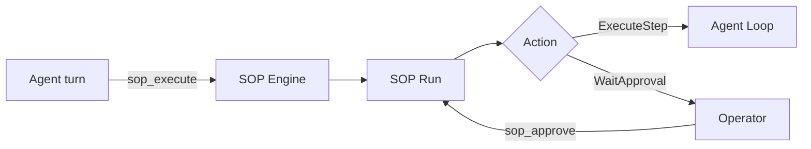

# Standard Operating Procedures (SOP)

SOPs are deterministic procedures executed by the `SopEngine`. They provide explicit trigger matching, approval gates, and auditable run state.

## Quick Paths

- **Connectivity status:** [Connectivity](connectivity.md) — current manual entry point and unwired external trigger schemas.
- **Write SOPs:** [Syntax Reference](syntax.md) — required file layout and trigger/step syntax.
- **Monitor:** [Observability & Audit](observability.md) — where run state and audit entries are stored.
- **Examples:** [Cookbook](cookbook.md) — reusable SOP patterns.

## 1. Runtime Contract (Current)

- SOP definitions are loaded from `<workspace>/sops/<sop_name>/SOP.toml` plus optional `SOP.md`.
- CLI `naraeclaw sop` currently manages definitions only: `list`, `validate`, `show`.
- SOP runs are currently started by the in-agent tool `sop_execute`. MQTT/webhook/cron
  trigger schemas exist, but external event fan-in is not wired into the daemon or gateway.
- Run progression uses tools: `sop_status`, `sop_approve`, `sop_advance`.
- SOP audit logging still uses the legacy Memory compatibility interface. It is durable
  only when ByoriDB knowledge is disabled and a persistent legacy `[memory]` backend is
  explicitly active; default ByoriDB mode supplies a no-op compatibility handle and does
  not mix operational SOP events into the knowledge graph.

## 2. Event Flow



## 3. Getting Started

1. Enable SOP subsystem in `config.toml`:

   ```toml
   [sop]
   enabled = true
   sops_dir = "sops"  # defaults to <workspace>/sops when omitted
   ```

2. Create a SOP directory, for example:

   ```text
   ~/.naraeclaw/workspace/sops/deploy-prod/SOP.toml
   ~/.naraeclaw/workspace/sops/deploy-prod/SOP.md
   ```

3. Validate and inspect definitions:

   ```bash
   naraeclaw sop list
   naraeclaw sop validate
   naraeclaw sop show deploy-prod
   ```

4. Trigger runs manually from an agent turn with `sop_execute`.

For current connectivity limitations, see [Connectivity](connectivity.md).
